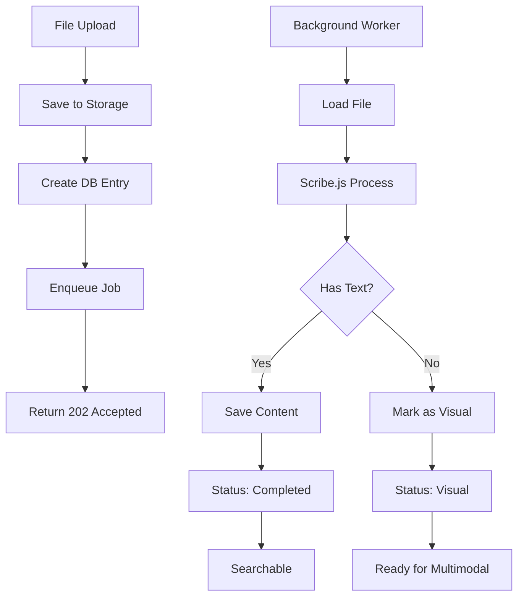

# PageSpace Document Processing Implementation Guide (Simplified Scribe.js Approach)

## Executive Summary

This document outlines a simplified implementation for adding OCR and text extraction to PageSpace using Scribe.js. The system extracts all text at upload time using a single library that handles PDFs, images, and mixed documents automatically.

## Table of Contents

1. [Architecture Overview](#architecture-overview)
2. [Current State](#current-state)
3. [Implementation Phases](#implementation-phases)
4. [Phase 1: Database & Status Tracking](#phase-1-database--status-tracking)
5. [Phase 2: Background Job Infrastructure](#phase-2-background-job-infrastructure)
6. [Phase 3: Scribe.js Integration](#phase-3-scribejs-integration)
7. [Phase 4: Upload Flow & Status API](#phase-4-upload-flow--status-api)
8. [Phase 5: Multimodal Fallback](#phase-5-multimodal-fallback)
9. [Testing & Monitoring](#testing--monitoring)
10. [Deployment Checklist](#deployment-checklist)

## Architecture Overview

### Core Principles

1. **Single library solution** - Scribe.js handles all text extraction (PDFs, images, mixed documents)
2. **Asynchronous processing** - All extraction happens in background jobs to prevent timeouts
3. **Progressive enhancement** - System remains functional even when extraction fails
4. **Unified approach** - No need for separate PDF/OCR/image pipelines

### Simplified Processing Flow



## Current State

### What's Already Implemented

✅ **File upload and storage** (`/api/upload/route.ts`)
- Files stored in filesystem
- Metadata saved to database
- Support for 40+ file types

✅ **Basic text extraction** (`packages/lib/src/file-processor.ts`)
- PDF text extraction using pdf-parse
- DOCX extraction using mammoth
- Plain text files

✅ **AI integration** (`apps/web/src/lib/ai/tools/page-read-tools.ts`)
- read_page tool works with extracted content
- @mention system

### What's Missing

❌ **OCR for scanned documents and images**
❌ **Unified extraction pipeline**
❌ **Background processing**
❌ **Processing status tracking**
❌ **Multimodal fallback for visual content**

## Implementation Phases

### Phase Timeline

- **Phase 1**: Database & Status Tracking (1 day)
- **Phase 2**: Background Job Infrastructure (1 day)
- **Phase 3**: Scribe.js Integration (1 day)
- **Phase 4**: Upload Flow & Status API (1 day)
- **Phase 5**: Multimodal Fallback (1 day)
- **Total**: ~5 days (50% faster than original plan)

## Phase 1: Database & Status Tracking

### 1.1 Database Migration

Create `packages/db/src/migrations/add_processing_status.sql`:

```sql
-- Add processing status columns using consistent camelCase
ALTER TABLE pages 
ADD COLUMN "processingStatus" TEXT DEFAULT 'pending',
ADD COLUMN "processingError" TEXT,
ADD COLUMN "processedAt" TIMESTAMP,
ADD COLUMN "extractionMethod" TEXT,
ADD COLUMN "extractionMetadata" JSONB,
ADD COLUMN "contentHash" TEXT;

-- Create index for status queries
CREATE INDEX idx_pages_processing_status ON pages("processingStatus");

-- Backfill existing data
UPDATE pages 
SET "processingStatus" = CASE 
  WHEN content IS NOT NULL AND content != '' THEN 'completed'
  ELSE 'pending'
END,
"processedAt" = NOW()
WHERE "processingStatus" IS NULL;
```

### 1.2 Update Drizzle Schema

Update `packages/db/src/schema/core.ts`:

```typescript
export const pages = pgTable('pages', {
  // ... existing fields ...
  
  // Processing status fields (consistent camelCase)
  processingStatus: text('processingStatus').default('pending'),
  processingError: text('processingError'),
  processedAt: timestamp('processedAt'),
  extractionMethod: text('extractionMethod'), // 'text', 'ocr', 'hybrid', 'visual'
  extractionMetadata: jsonb('extractionMetadata'),
  contentHash: text('contentHash'), // SHA-256 hash for deduplication
});
```

### 1.3 TypeScript Types

Update `packages/lib/src/types.ts`:

```typescript
export type ProcessingStatus = 'pending' | 'processing' | 'completed' | 'failed' | 'visual';
export type ExtractionMethod = 'text' | 'ocr' | 'hybrid' | 'visual' | 'none';

export interface ExtractionMetadata {
  pageCount?: number;
  wordCount?: number;
  characterCount?: number;
  processingTimeMs?: number;
  extractionMethod?: ExtractionMethod;
  scribeVersion?: string;
  languages?: string[];
  confidence?: number;
}

export interface ExtractionResult {
  success: boolean;
  content: string;
  processingStatus: ProcessingStatus;
  extractionMethod?: ExtractionMethod;
  metadata?: ExtractionMetadata;
  error?: string;
  contentHash?: string;
}
```

## Phase 2: Background Job Infrastructure

### 2.1 Install Dependencies

```bash
# Job queue
pnpm --filter @pagespace/lib add pg-boss

# Scribe.js for text extraction
pnpm --filter @pagespace/lib add scribe.js
```

### 2.2 Job Queue Setup

Create `packages/lib/src/job-queue.ts`:

```typescript
import PgBoss from 'pg-boss';
import { db, pages, eq } from '@pagespace/db';

export class JobQueue {
  private boss: PgBoss;
  private isStarted = false;
  
  constructor(databaseUrl: string) {
    this.boss = new PgBoss(databaseUrl);
  }
  
  async start(): Promise<void> {
    if (this.isStarted) return;
    
    await this.boss.start();
    this.isStarted = true;
    
    // Register job handlers
    await this.registerHandlers();
  }
  
  async stop(): Promise<void> {
    if (!this.isStarted) return;
    
    await this.boss.stop();
    this.isStarted = false;
  }
  
  async enqueueFileProcessing(pageId: string, priority: 'high' | 'normal' = 'normal'): Promise<string> {
    const jobId = await this.boss.send(
      'process-file',
      { pageId },
      {
        priority: priority === 'high' ? 10 : 0,
        retryLimit: 3,
        retryDelay: 60,
        expireInSeconds: 600 // 10 minute timeout
      }
    );
    
    console.log(`Enqueued file processing job ${jobId} for page ${pageId}`);
    return jobId;
  }
  
  private async registerHandlers(): Promise<void> {
    await this.boss.work(
      'process-file',
      { teamSize: 2, teamConcurrency: 1 }, // Process 2 jobs concurrently
      async (job) => {
        const { pageId } = job.data;
        
        try {
          // Update status to processing
          await db.update(pages)
            .set({ processingStatus: 'processing' })
            .where(eq(pages.id, pageId));
          
          // Process with Scribe
          const { ScribeProcessor } = await import('./scribe-processor');
          const processor = new ScribeProcessor();
          const result = await processor.processFile(pageId);
          
          // Update page with results
          await db.update(pages)
            .set({
              content: result.content || '',
              processingStatus: result.processingStatus,
              processingError: result.error,
              extractionMethod: result.extractionMethod,
              extractionMetadata: result.metadata,
              contentHash: result.contentHash,
              processedAt: new Date()
            })
            .where(eq(pages.id, pageId));
          
          console.log(`Completed processing for page ${pageId}: ${result.processingStatus}`);
          
        } catch (error) {
          console.error(`Failed to process file for page ${pageId}:`, error);
          
          await db.update(pages)
            .set({
              processingStatus: 'failed',
              processingError: error instanceof Error ? error.message : 'Unknown error',
              processedAt: new Date()
            })
            .where(eq(pages.id, pageId));
          
          throw error; // Let pg-boss handle retry
        }
      }
    );
  }
  
  async getJobStatus(jobId: string): Promise<any> {
    return await this.boss.getJobById(jobId);
  }
  
  async getQueueStats(): Promise<any> {
    return {
      created: await this.boss.getQueueSize('created'),
      retry: await this.boss.getQueueSize('retry'),
      active: await this.boss.getQueueSize('active'),
      completed: await this.boss.getQueueSize('completed'),
      failed: await this.boss.getQueueSize('failed')
    };
  }
}

// Singleton instance
let jobQueue: JobQueue | null = null;

export async function getJobQueue(): Promise<JobQueue> {
  if (!jobQueue) {
    const databaseUrl = process.env.DATABASE_URL;
    if (!databaseUrl) {
      throw new Error('DATABASE_URL is not configured');
    }
    
    jobQueue = new JobQueue(databaseUrl);
    await jobQueue.start();
  }
  
  return jobQueue;
}
```

### 2.3 Worker Process

Create `apps/web/src/workers/file-processor.ts`:

```typescript
#!/usr/bin/env node
import { getJobQueue } from '@pagespace/lib/job-queue';

process.on('SIGTERM', gracefulShutdown);
process.on('SIGINT', gracefulShutdown);

let isShuttingDown = false;

async function gracefulShutdown() {
  if (isShuttingDown) return;
  isShuttingDown = true;
  
  console.log('Gracefully shutting down file processor worker...');
  
  const queue = await getJobQueue();
  await queue.stop();
  
  process.exit(0);
}

async function main() {
  console.log('Starting file processor worker...');
  
  try {
    const queue = await getJobQueue();
    console.log('File processor worker started successfully');
    
    // Keep the process alive
    setInterval(() => {
      // Health check
    }, 60000);
    
  } catch (error) {
    console.error('Failed to start file processor worker:', error);
    process.exit(1);
  }
}

main();
```

Add to `package.json`:
```json
{
  "scripts": {
    "worker:file-processor": "tsx apps/web/src/workers/file-processor.ts",
    "dev": "concurrently \"pnpm run dev:web\" \"pnpm run worker:file-processor\""
  }
}
```

## Phase 3: Scribe.js Integration

### 3.1 Scribe Processor

Create `packages/lib/src/scribe-processor.ts`:

```typescript
import * as scribe from 'scribe.js';
import { readFile } from 'fs/promises';
import { join } from 'path';
import { createHash } from 'crypto';
import { db, pages, eq } from '@pagespace/db';
import type { ExtractionResult } from './types';

export class ScribeProcessor {
  private STORAGE_ROOT: string;
  
  constructor() {
    this.STORAGE_ROOT = process.env.FILE_STORAGE_PATH || '/tmp/pagespace-files';
    
    // Initialize Scribe.js
    scribe.init({
      // Use local processing (no external APIs)
      ocr: true,
      pdfText: true,
      langs: ['eng'], // Add more languages as needed
    });
  }
  
  async processFile(pageId: string): Promise<ExtractionResult> {
    const startTime = Date.now();
    
    try {
      // Get page data from database
      const [page] = await db
        .select()
        .from(pages)
        .where(eq(pages.id, pageId))
        .limit(1);
      
      if (!page || !page.filePath) {
        return {
          success: false,
          content: '',
          processingStatus: 'failed',
          error: 'Page or file path not found'
        };
      }
      
      // Read file
      const fullPath = join(this.STORAGE_ROOT, page.filePath);
      const buffer = await readFile(fullPath);
      
      // Calculate content hash for deduplication
      const contentHash = createHash('sha256').update(buffer).digest('hex');
      
      // Check if we've already processed this exact file
      if (page.contentHash === contentHash && page.processingStatus === 'completed') {
        console.log(`Skipping duplicate file for page ${pageId}`);
        return {
          success: true,
          content: page.content || '',
          processingStatus: 'completed',
          extractionMethod: page.extractionMethod as any,
          contentHash
        };
      }
      
      // Process with Scribe.js
      console.log(`Processing ${page.mimeType} file for page ${pageId}`);
      
      const result = await this.extractWithScribe(buffer, page.mimeType);
      
      // Calculate metadata
      const metadata = {
        ...result.metadata,
        processingTimeMs: Date.now() - startTime,
        wordCount: result.content.split(/\s+/).filter(w => w).length,
        characterCount: result.content.length,
        scribeVersion: scribe.version
      };
      
      return {
        success: result.success,
        content: result.content,
        processingStatus: result.processingStatus,
        extractionMethod: result.extractionMethod,
        metadata,
        contentHash
      };
      
    } catch (error) {
      console.error(`Processing failed for page ${pageId}:`, error);
      return {
        success: false,
        content: '',
        processingStatus: 'failed',
        error: error instanceof Error ? error.message : 'Unknown error',
        metadata: {
          processingTimeMs: Date.now() - startTime
        }
      };
    }
  }
  
  private async extractWithScribe(
    buffer: Buffer,
    mimeType: string
  ): Promise<{
    success: boolean;
    content: string;
    processingStatus: ProcessingStatus;
    extractionMethod: ExtractionMethod;
    metadata: any;
  }> {
    try {
      // Scribe.js handles all file types automatically
      const extracted = await scribe.extractText(buffer, {
        // Scribe options
        langs: ['eng'],
        outputFormat: 'text',
        onProgress: (progress: number) => {
          if (progress % 10 === 0) {
            console.log(`Extraction progress: ${progress}%`);
          }
        }
      });
      
      // Determine extraction method based on what Scribe did
      let extractionMethod: ExtractionMethod = 'text';
      if (extracted.ocr && extracted.text) {
        extractionMethod = 'hybrid';
      } else if (extracted.ocr) {
        extractionMethod = 'ocr';
      }
      
      // Check if we got meaningful content
      const hasContent = extracted.text && extracted.text.trim().length > 0;
      
      return {
        success: hasContent,
        content: extracted.text || '',
        processingStatus: hasContent ? 'completed' : 'visual',
        extractionMethod: hasContent ? extractionMethod : 'visual',
        metadata: {
          pageCount: extracted.pageCount,
          confidence: extracted.confidence,
          languages: extracted.languages,
          method: extractionMethod
        }
      };
      
    } catch (error) {
      console.error('Scribe extraction failed:', error);
      throw error;
    }
  }
  
  /**
   * Sanitize content for storage
   */
  private sanitizeContent(content: string): string {
    // Remove null bytes and other problematic characters
    return content
      .replace(/\0/g, '')
      .replace(/\r\n/g, '\n')
      .trim();
  }
}
```

### 3.2 Next.js Configuration

Update `apps/web/next.config.js`:

```javascript
/** @type {import('next').NextConfig} */
const nextConfig = {
  // ... existing config ...
  
  webpack: (config, { isServer }) => {
    // Prevent Scribe.js from using Node.js implementations during build
    if (!isServer) {
      config.resolve.fallback = {
        ...config.resolve.fallback,
        process: false
      };
    }
    
    return config;
  },
};

module.exports = nextConfig;
```

## Phase 4: Upload Flow & Status API

### 4.1 Updated Upload Route

Update `apps/web/src/app/api/upload/route.ts`:

```typescript
import { getJobQueue } from '@pagespace/lib/job-queue';
import { stat } from 'fs/promises';

export async function POST(request: Request) {
  // ... existing file upload logic ...
  
  // Create page entry with pending status
  const [newPage] = await db.insert(pages).values({
    id: pageId,
    title: title || sanitizedFileName,
    type: PageType.FILE,
    content: '', // Will be populated by background job
    processingStatus: 'pending',
    filePath: join('files', driveId, pageId, sanitizedFileName),
    mimeType,
    // ... other fields ...
  }).returning();
  
  // Enqueue processing job
  try {
    const jobQueue = await getJobQueue();
    
    // Check file size for priority
    const fileStats = await stat(fullPath);
    const priority = fileStats.size < 5_000_000 ? 'high' : 'normal';
    
    const jobId = await jobQueue.enqueueFileProcessing(pageId, priority);
    
    console.log(`File uploaded: ${sanitizedFileName}, Job: ${jobId}`);
    
    // Return 202 Accepted
    return NextResponse.json(
      {
        success: true,
        page: {
          ...newPage,
          processingJobId: jobId
        },
        message: 'File uploaded successfully. Processing in background.',
        processingStatus: 'pending'
      },
      { status: 202 }
    );
    
  } catch (error) {
    console.error('Failed to enqueue processing:', error);
    
    // Upload succeeded but processing failed to start
    return NextResponse.json({
      success: true,
      page: newPage,
      warning: 'File uploaded but processing could not be started.',
      processingStatus: 'failed'
    });
  }
}
```

### 4.2 Processing Status Endpoint

Create `apps/web/src/app/api/pages/[id]/processing-status/route.ts`:

```typescript
import { NextResponse } from 'next/server';
import { db, pages, eq } from '@pagespace/db';
import { getJobQueue } from '@pagespace/lib/job-queue';

export async function GET(
  request: Request,
  context: { params: Promise<{ id: string }> }
) {
  const { id } = await context.params;
  
  try {
    // Get page status
    const [page] = await db
      .select({
        processingStatus: pages.processingStatus,
        processingError: pages.processingError,
        extractionMethod: pages.extractionMethod,
        extractionMetadata: pages.extractionMetadata,
        processedAt: pages.processedAt,
        content: pages.content
      })
      .from(pages)
      .where(eq(pages.id, id))
      .limit(1);
    
    if (!page) {
      return NextResponse.json(
        { error: 'Page not found' },
        { status: 404 }
      );
    }
    
    // Return final status if processing is done
    if (page.processingStatus !== 'pending' && page.processingStatus !== 'processing') {
      return NextResponse.json({
        status: page.processingStatus,
        error: page.processingError,
        extractionMethod: page.extractionMethod,
        metadata: page.extractionMetadata,
        processedAt: page.processedAt,
        hasContent: !!page.content && page.content.length > 0
      });
    }
    
    // For pending/processing, check queue
    const jobQueue = await getJobQueue();
    const stats = await jobQueue.getQueueStats();
    
    return NextResponse.json({
      status: page.processingStatus,
      queuePosition: stats.created + stats.retry,
      activeJobs: stats.active,
      estimatedWaitTime: (stats.created + stats.retry) * 15, // seconds
      message: 'File is being processed. Please check back shortly.'
    });
    
  } catch (error) {
    console.error('Error fetching status:', error);
    return NextResponse.json(
      { error: 'Failed to fetch status' },
      { status: 500 }
    );
  }
}
```

### 4.3 Reprocess Endpoint

Create `apps/web/src/app/api/pages/[id]/reprocess/route.ts`:

```typescript
import { NextResponse } from 'next/server';
import { db, pages, eq } from '@pagespace/db';
import { getJobQueue } from '@pagespace/lib/job-queue';

export async function POST(
  request: Request,
  context: { params: Promise<{ id: string }> }
) {
  const { id } = await context.params;
  
  try {
    // Reset status to pending
    await db.update(pages)
      .set({ 
        processingStatus: 'pending',
        processingError: null
      })
      .where(eq(pages.id, id));
    
    // Enqueue new job
    const jobQueue = await getJobQueue();
    const jobId = await jobQueue.enqueueFileProcessing(id, 'high');
    
    return NextResponse.json({
      success: true,
      jobId,
      message: 'File queued for reprocessing'
    });
    
  } catch (error) {
    console.error('Reprocess failed:', error);
    return NextResponse.json(
      { error: 'Failed to reprocess file' },
      { status: 500 }
    );
  }
}
```

## Phase 5: Multimodal Fallback

### 5.1 Model Capabilities

Create `apps/web/src/lib/ai/model-capabilities.ts`:

```typescript
export interface ModelCapabilities {
  vision: boolean;
  maxImageSize?: number;
  supportedImageTypes?: string[];
}

export const MODEL_CAPABILITIES: Record<string, ModelCapabilities> = {
  'gpt-4o': {
    vision: true,
    maxImageSize: 20_000_000,
    supportedImageTypes: ['image/jpeg', 'image/png', 'image/gif', 'image/webp']
  },
  'gpt-4o-mini': {
    vision: true,
    maxImageSize: 20_000_000,
    supportedImageTypes: ['image/jpeg', 'image/png', 'image/gif', 'image/webp']
  },
  'claude-3-5-sonnet': {
    vision: true,
    maxImageSize: 5_000_000,
    supportedImageTypes: ['image/jpeg', 'image/png', 'image/gif', 'image/webp']
  },
  'gemini-1.5-pro': {
    vision: true,
    maxImageSize: 10_000_000,
    supportedImageTypes: ['image/jpeg', 'image/png', 'image/webp']
  },
  // Text-only models
  'gpt-3.5-turbo': { vision: false },
  'llama-3': { vision: false },
};

export function getModelCapabilities(modelName: string): ModelCapabilities {
  // Handle model variants (e.g., "gpt-4o-2024-11-20" -> "gpt-4o")
  const baseModel = Object.keys(MODEL_CAPABILITIES).find(key => 
    modelName.startsWith(key)
  );
  
  return MODEL_CAPABILITIES[baseModel || modelName] || { vision: false };
}
```

### 5.2 Enhanced read_page Tool

Update `apps/web/src/lib/ai/tools/page-read-tools.ts`:

```typescript
import { getModelCapabilities } from '@/lib/ai/model-capabilities';
import { readFile } from 'fs/promises';
import { join } from 'path';

export const pageReadTools = {
  read_page: tool({
    // ... existing setup ...
    
    execute: async ({ path, pageId }, { experimental_context: context }) => {
      const userId = (context as ToolExecutionContext)?.userId;
      const aiModel = (context as ToolExecutionContext)?.aiModel;
      
      // ... existing page fetching logic ...
      
      // Handle FILE type pages
      if (page.type === 'FILE') {
        // Check processing status
        switch (page.processingStatus) {
          case 'pending':
          case 'processing':
            return {
              success: false,
              error: 'File is still being processed',
              status: page.processingStatus,
              suggestion: 'Please try again in a moment'
            };
          
          case 'visual':
            // Pure visual content - check for multimodal support
            if (aiModel && getModelCapabilities(aiModel).vision) {
              return {
                success: true,
                type: 'visual_reference',
                path,
                title: page.title,
                fileRef: page.id, // Reference for the chat route to load
                mimeType: page.mimeType,
                requiresVision: true,
                message: 'This is a visual file that requires a vision-capable model'
              };
            }
            
            return {
              success: false,
              error: 'This file contains only visual content',
              status: 'visual',
              suggestion: 'Use a vision-capable model (GPT-4o, Claude 3.5, Gemini) to analyze this file'
            };
          
          case 'failed':
            return {
              success: false,
              error: 'Failed to extract content from this file',
              processingError: page.processingError,
              suggestion: 'Try reprocessing the file or contact support'
            };
          
          case 'completed':
            // Normal text content available
            break;
        }
      }
      
      // Process text content
      const lines = page.content.split('\n');
      const numberedContent = lines
        .map((line, index) => `${index + 1}→${line}`)
        .join('\n');
      
      return {
        success: true,
        path,
        title: page.title,
        type: page.type,
        content: numberedContent,
        lineCount: lines.length,
        metadata: page.type === 'FILE' ? {
          extractionMethod: page.extractionMethod,
          extractionMetadata: page.extractionMetadata
        } : undefined
      };
    },
  }),
};
```

### 5.3 Chat Route Vision Support

Update `apps/web/src/app/api/ai/chat/route.ts`:

```typescript
// In the tool result processing section of your chat route:
// When a tool returns a visual_reference type result
if (toolResult.type === 'visual_reference' && toolResult.fileRef) {
  const capabilities = getModelCapabilities(modelName);
  
  if (capabilities.vision) {
    // Fetch the page to get the file path
    const [page] = await db
      .select()
      .from(pages)
      .where(eq(pages.id, toolResult.fileRef))
      .limit(1);
    
    if (page && page.filePath) {
      const FILE_STORAGE_PATH = process.env.FILE_STORAGE_PATH || '/tmp/pagespace-files';
      const filePath = join(FILE_STORAGE_PATH, page.filePath);
      const fileBuffer = await readFile(filePath);
      
      // Modify the message to include the image
      // This depends on your AI SDK implementation
      // Example for Vercel AI SDK:
      messages.push({
        role: 'user',
        content: [
          { type: 'text', text: toolResult.message || 'Analyzing visual content' },
          { 
            type: 'image_url',
            image_url: {
              url: `data:${page.mimeType};base64,${fileBuffer.toString('base64')}`
            }
          }
        ]
      });
    }
  } else {
    // Model doesn't support vision, return error message
    messages.push({
      role: 'assistant',
      content: 'This file requires visual analysis but the current model does not support vision. Please switch to a vision-capable model like GPT-4o or Claude 3.5.'
    });
  }
}
```

## Testing & Monitoring

### Test Files Checklist

1. **Text PDF** - Regular PDF with selectable text
2. **Scanned PDF** - Image-based PDF requiring OCR
3. **Mixed PDF** - Some pages text, some scanned
4. **Screenshots** - PNG/JPG with text
5. **Photos** - Images without text
6. **DOCX/XLSX** - Office documents
7. **Code files** - Various programming languages
8. **Large files** - Test timeout handling

### Test Script

Create `scripts/test-extraction.ts`:

```typescript
import { ScribeProcessor } from '@pagespace/lib/scribe-processor';
import { readdir } from 'fs/promises';
import { join } from 'path';

async function testFiles() {
  const processor = new ScribeProcessor();
  const testDir = './test-files';
  const files = await readdir(testDir);
  
  for (const file of files) {
    console.log(`\nTesting: ${file}`);
    const startTime = Date.now();
    
    try {
      const result = await processor.processFile(join(testDir, file));
      console.log(`✓ Status: ${result.processingStatus}`);
      console.log(`  Method: ${result.extractionMethod}`);
      console.log(`  Words: ${result.metadata?.wordCount || 0}`);
      console.log(`  Time: ${Date.now() - startTime}ms`);
    } catch (error) {
      console.log(`✗ Failed: ${error.message}`);
    }
  }
}

testFiles();
```

### Monitoring Dashboard

Create `apps/web/src/app/admin/processing/page.tsx`:

```typescript
'use client';

import { useEffect, useState } from 'react';

export default function ProcessingDashboard() {
  const [stats, setStats] = useState(null);
  
  useEffect(() => {
    const fetchStats = async () => {
      const res = await fetch('/api/admin/processing-stats');
      const data = await res.json();
      setStats(data);
    };
    
    fetchStats();
    const interval = setInterval(fetchStats, 5000);
    return () => clearInterval(interval);
  }, []);
  
  if (!stats) return <div>Loading...</div>;
  
  return (
    <div>
      <h1>Processing Queue Status</h1>
      <div>
        <p>Pending: {stats.created}</p>
        <p>Processing: {stats.active}</p>
        <p>Completed: {stats.completed}</p>
        <p>Failed: {stats.failed}</p>
        <p>Retry: {stats.retry}</p>
      </div>
    </div>
  );
}
```

## Deployment Checklist

### Pre-deployment

- [ ] Run database migrations to add processing columns
- [ ] Install dependencies: `pnpm install`
- [ ] Configure environment variables
- [ ] Test Scribe.js locally with sample files

### Deployment

- [ ] Deploy database migrations
- [ ] Deploy updated application code
- [ ] Start background worker process
- [ ] Configure worker process monitoring (PM2/systemd)
- [ ] Test file upload and processing

### Post-deployment

- [ ] Monitor queue statistics
- [ ] Check processing success rate
- [ ] Review error logs
- [ ] Test multimodal fallback with vision models
- [ ] Update user documentation

### Rollback Plan

1. Stop worker process
2. Revert code deployment
3. Keep database columns (they're backward compatible)
4. Restart services

## Performance Expectations

### Processing Times (per file)

- **Text PDFs**: 1-5 seconds
- **Scanned PDFs (10 pages)**: 15-30 seconds
- **Images**: 3-10 seconds
- **Office documents**: 2-8 seconds

### Throughput

- **Concurrent jobs**: 2 (configurable)
- **Files per minute**: 10-20 (depending on type)
- **Queue capacity**: Unlimited (database-backed)

## Advantages of This Approach

### Compared to Original Plan

1. **50% less code** - Single library instead of multiple
2. **Faster implementation** - 5 days vs 10-11 days
3. **Better accuracy** - Scribe.js has superior OCR
4. **Simpler maintenance** - One dependency to update
5. **Unified pipeline** - No separate PDF/image/OCR paths
6. **Production-ready** - Background processing from day one
7. **Better error handling** - Retry logic built-in
8. **Scalable** - Can add more workers as needed

### Technical Benefits

- **No external binaries** - Pure JavaScript/WebAssembly
- **Cross-platform** - Works on Mac, Linux, Windows
- **Consistent API** - Same interface for all file types
- **Progress tracking** - Built-in progress callbacks
- **Language detection** - Automatic language identification
- **Mixed content** - Handles PDFs with both text and images

## Conclusion

This simplified approach using Scribe.js provides a robust, production-ready document processing system that:

1. Extracts all possible text at upload time
2. Handles all file types with a single library
3. Processes files asynchronously to prevent timeouts
4. Provides clear status tracking
5. Falls back to multimodal AI for visual content
6. Scales horizontally by adding workers

The implementation is significantly simpler than the original multi-library approach while providing better results and maintainability.

---

*Document Version: 2.0 (Simplified Scribe.js Approach)*  
*Last Updated: January 2025*  
*Author: PageSpace Development Team*