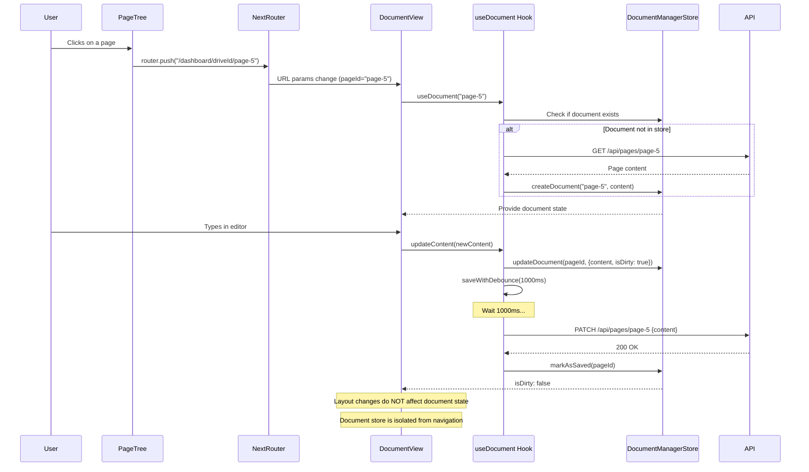

# Frontend State Management Architecture

**Last Updated:** 2025-12-19

This document provides a definitive guide to the frontend state management system in this application. It is designed to be the single source of truth for understanding how application data and UI state are fetched, cached, managed, and displayed.

## Table of Contents

1. [Core Architectural Principles](#core-architectural-principles)
2. [The Four Types of State](#the-four-types-of-state)
3. [Key Stores and Hooks](#key-stores-and-hooks)
4. [Data Flow in Practice](#data-flow-in-practice)
5. [Critical: Document State Decoupling](#critical-document-state-decoupling)
6. [Best Practices](#best-practices)

## 1. Core Architectural Principles

Our architecture is built on a **server-centric** model for data, with clear separation between four types of client-side state. This separation was refined after identifying systemic re-render issues (see [SYSTEMIC-RE-RENDER-ISSUE.md](../../SYSTEMIC-RE-RENDER-ISSUE.md)).

### The Four Pillars

1. **Server State (The Truth):** All core data (pages, drives, users) resides in the database. SWR is our primary tool for fetching, caching, and revalidating this server state. The database is the ultimate source of truth.

2. **Application State (Pointers):** Simple Zustand stores that hold pointers to the user's current context, such as the active drive and page. They don't hold the data itself, but rather the IDs that other hooks use to fetch the data.

3. **Document State (Content & Editing):** **Completely separate from layout and navigation.** Managed by `useDocumentManagerStore`, this handles all document content, dirty state, auto-save logic, and multi-document management. This decoupling prevents re-render cascades during editing.

4. **UI State (The "Look and Feel"):** Persisted Zustand store that manages the state of the UI itself—unrelated to data or content. This includes sidebar visibility, which folders are expanded in the navigation tree, and scroll positions.

### Why Document State is Separate

**Critical Architectural Decision:** Document state (content, `isDirty`, auto-save timers) is managed by a dedicated store (`useDocumentManagerStore`) that is **completely decoupled** from layout navigation and UI state.

**Before this separation:**
- Every navigation action triggered document component re-renders
- SWR revalidations caused cursor jumps during typing
- Auto-save was interrupted by layout updates
- `isDirty` flags reset unexpectedly
- Users experienced constant micro-interruptions

**After this separation:**
- Document editing is stable and isolated
- Layout changes don't affect document state
- Auto-save works reliably
- Cursor position is preserved
- Clean separation of concerns

See [Editor Architecture](../2.6-features/editor-architecture.md) for comprehensive documentation of the document editing system.

## 2. The Four Types of State

### Server State (SWR)

**Purpose:** Fetching, caching, and revalidating data from the API.

**Tools:** SWR (stale-while-revalidate) hooks

**Examples:**
- Page tree navigation data
- Page content for display (not editing)
- Drive lists
- User information
- Breadcrumb paths

**Key Pattern:**
```typescript
const { data, error, isLoading, mutate } = useSWR(
  key,
  fetcher,
  {
    refreshInterval: 300000, // 5 minutes
    revalidateOnFocus: false, // Prevent interruptions
    isPaused: () => isAnyActive, // Pause during editing
  }
);
```

### Application State (URL-based Navigation)

**Purpose:** Track what the user is currently viewing.

**Tool:** Next.js App Router `useParams()` hook

**Pattern:** Navigation state is derived from the URL, not stored in Zustand. This follows Next.js App Router best practices where the URL is the source of truth for navigation.

**Key Pattern:**
```typescript
// Navigation state comes from URL params
const params = useParams();
const driveId = params.driveId as string;
const pageId = params.pageId as string;
```

**Note:** PageSpace uses URL-based navigation rather than Zustand for tracking active pages. This provides automatic browser history support, shareable URLs, and simpler state management.

### Document State (Content & Editing)

**Purpose:** Manage document content, dirty state, auto-save, and multi-document editing.

**Tool:** `useDocumentManagerStore` (Zustand) + `useDocument` hook

**CRITICAL:** This is **completely separate** from application/layout state.

**State Structure:**
```typescript
interface DocumentState {
  id: string;                    // Page ID
  content: string;               // HTML content
  isDirty: boolean;              // Has unsaved changes?
  version: number;               // Version counter
  lastSaved: number;             // Timestamp of last save
  lastUpdateTime: number;        // Timestamp of last edit
  saveTimeout?: NodeJS.Timeout;  // Active save timer
}

interface DocumentManagerState {
  documents: Map<string, DocumentState>;  // All open documents
  activeDocumentId: string | null;
  savingDocuments: Set<string>;
}
```

**Why It's Separate:**
- Prevents layout changes from affecting document state
- Isolates auto-save logic from navigation
- Enables stable multi-document editing
- Protects cursor position during SWR revalidations

**Key Pattern:**
```typescript
const {
  document,
  updateContent,           // User edits (marks dirty, triggers save)
  updateContentFromServer, // External updates (no dirty flag)
  updateContentSilently,   // Prettier formatting (no dirty, no save)
  saveWithDebounce,
  forceSave,
} = useDocument(pageId);
```

### UI State (Look & Feel)

**Purpose:** Persist user interface preferences.

**Tool:** Zustand with `persist` middleware

**Stores:**
- UI store: Sidebar states, expanded folders, scroll positions
- Favorites: User's favorite pages
- Theme preferences
- Modal states

**Key Pattern:**
```typescript
const { leftSidebarOpen, treeExpanded, setTreeExpanded } = useUIStore();
```

## 3. Key Stores and Hooks

### Layout Store (Sidebar State)

**File:** `apps/web/src/stores/useLayoutStore.ts`

**Responsibilities:**
- Manage sidebar open/closed states (persisted to localStorage)
- Track hydration state

**Key State:**
```typescript
{
  leftSidebarOpen: boolean;
  rightSidebarOpen: boolean;
  rehydrated: boolean;
}
```

**Note:** This store is focused only on sidebar visibility. Navigation state (active page, drive) is managed via URL params using Next.js App Router's `useParams()` hook. This separation keeps the store simple and leverages the browser's built-in navigation.

### Document Manager Store (Content & Editing)

**File:** `apps/web/src/stores/useDocumentManagerStore.ts`

**Responsibilities:**
- Store content for all open documents (Map structure)
- Track dirty state (`isDirty`) for each document
- Manage auto-save timers
- Track which documents are currently saving
- Coordinate multi-document editing

**Access Pattern:**
```typescript
// ✅ CORRECT: Use the hook, not the store directly
const { document, updateContent, saveWithDebounce } = useDocument(pageId);

// ❌ WRONG: Don't access store directly in components
const document = useDocumentManagerStore(state => state.documents.get(pageId));
```

**Key Actions:**
- `createDocument(pageId, initialContent)` - Initialize document state
- `updateDocument(pageId, updates)` - Update document properties
- `markAsSaving(pageId)` - Track save in progress
- `markAsSaved(pageId)` - Clear dirty flag after successful save
- `clearDocument(pageId)` - Remove document from store

**Critical Design Decisions:**

1. **Map-based Storage:** Uses `Map<string, DocumentState>` to efficiently manage multiple documents
2. **Timestamp Tracking:** `lastUpdateTime` prevents marking as saved if user typed during save operation
3. **Timer Management:** Each document has its own `saveTimeout` for debounced saves
4. **Dirty State Isolation:** `isDirty` changes don't trigger layout re-renders

### The `useDocument` Hook

**File:** `apps/web/src/hooks/useDocument.ts`

**Purpose:** High-level API for components to interact with document state. This is the **only way** components should access document state.

**Full API:**
```typescript
const {
  document,                // Current document state (content, isDirty, etc.)
  isLoading,              // Loading initial content from server
  isSaving,               // Currently saving to server

  // Initialization
  initializeAndActivate,  // Initialize and fetch content

  // Content Updates (Three Types)
  updateContent,          // User edits (marks dirty, triggers save)
  updateContentFromServer, // External updates (no dirty flag)
  updateContentSilently,  // Prettier formatting (no dirty, no save)

  // Saving
  saveWithDebounce,       // Debounced save (1000ms)
  forceSave,              // Immediate save (Cmd+S, blur, unmount)

  // Cleanup
  clearDocument,          // Remove from store
} = useDocument(pageId);
```

**Three Content Update Types:**

| Method | Marks Dirty? | Triggers Save? | Use Case |
|--------|--------------|----------------|----------|
| `updateContent()` | ✅ Yes | ✅ Yes (1000ms) | User typing/editing |
| `updateContentFromServer()` | ❌ No | ❌ No | AI edits, other users, real-time sync |
| `updateContentSilently()` | ❌ No | ❌ No | Prettier auto-formatting |

This separation is critical to prevent save indicator flicker. See [Editor Architecture](../2.6-features/editor-architecture.md#content-update-types) for details.

### Drive Store (Application Pointers)

**File:** `apps/web/src/hooks/useDrive.ts`

**Responsibilities:**
- Hold current drive ID pointer
- Cache drive list (5-minute TTL)
- Provide drive switching logic

**State:**
```typescript
{
  currentDriveId: string | null;
  drives: Drive[];
  isLoading: boolean;
  lastFetched: number;
}
```

**Caching Strategy:** 5-minute client-side cache to avoid redundant API calls when switching between drives.

### UI Store (Tree State)

**File:** `apps/web/src/stores/useUIStore.ts`

**Responsibilities:**
- Persist expanded/collapsed folders in PageTree
- Persist scroll positions in the tree

**Persistence:** Uses `localStorage` via Zustand's `persist` middleware with custom serialization for `Set` types.

**State:**
```typescript
{
  treeExpanded: Set<string>;  // Set of expanded folder IDs
  treeScrollPosition: number;
}
```

**Access Pattern:**
```typescript
// Use the useTreeState hook for clean access
import { useTreeState } from '@/hooks/useUI';

const { expanded, isExpanded, toggleExpanded, scrollPosition } = useTreeState();
```

**Note:** Sidebar visibility is managed separately in `useLayoutStore`. The UI store is focused specifically on tree navigation state.

### Server State Hooks (SWR)

#### `usePageTree`

**File:** `apps/web/src/hooks/usePageTree.ts`

**Purpose:** Manage the hierarchical page navigation tree in the left sidebar.

**Responsibilities:**
- Fetch root pages for current drive
- Lazy-load children when folders are expanded
- Provide optimistic updates via `mutate`
- Track loading states for individual nodes
- Handle trash view vs normal view

**Data Source:**
- `GET /api/drives/[driveId]/pages` - Normal view
- `GET /api/drives/[driveId]/trash` - Trash view

**Key Functions:**
- `fetchAndMergeChildren(folderId)` - Lazy-load children
- `updateNode(nodeId, updates)` - Optimistic UI updates
- `mutate()` - Force revalidation

**Configuration:**
```typescript
useSWR(key, fetcher, {
  refreshInterval: 300000, // 5 minutes
  revalidateOnFocus: false, // Prevent interruptions during editing
  isPaused: () => isAnyActive, // Pause when editing/streaming
});
```

#### `useBreadcrumbs`

**File:** `apps/web/src/hooks/useBreadcrumbs.ts`

**Purpose:** Fetch and display breadcrumb navigation for the active page.

**Data Source:** `GET /api/pages/[pageId]/breadcrumbs`

**Returns:** Array of ancestor pages from root to current page.

## 4. Data Flow in Practice

### Complete Sequence Diagram



### Step-by-Step User Flow

#### 1. Initial Page Load

**URL:** `/dashboard/[driveId]/[pageId]`

1. Next.js App Router parses URL and provides params
2. Components use `useParams()` to access `driveId` and `pageId`
3. View component is selected based on page type

#### 2. Component Rendering

**LeftSidebar:**
- Uses `usePageTree(driveId)` to fetch navigation tree (driveId from URL params)
- Uses `useTreeState()` hook to determine which folders are expanded
- Renders tree with expand/collapse controls

**MiddleContent (DocumentView):**
- Gets `pageId` from `useParams()` hook
- Calls `useDocument(pageId)` hook
- Hook checks `useDocumentManagerStore` for existing document state
- If not in store, fetches from API and initializes
- Renders editor with document content

**RightSidebar:**
- Uses `usePageTree` and `pageId` from params to show page details
- Independent of document editing state

#### 3. User Clicks New Page

1. User clicks page in tree → `onClick` handler
2. Handler uses Next.js `router.push()` to navigate to new URL
3. URL changes → `useParams()` returns new `pageId`
4. **Document state is NOT cleared** - old document remains in store
5. `useDocument(newPageId)` initializes new document
6. Component re-renders with new content

**Key Point:** Multiple documents can exist in `useDocumentManagerStore` simultaneously. Switching pages doesn't lose unsaved work. Navigation is URL-driven, not store-driven.

#### 4. User Edits Document

1. User types in editor → `onChange` fires
2. Editor calls `updateContent(newContent)`
3. `useDocument` hook → `useDocumentManagerStore.updateDocument()`
4. Store updates: `content`, `isDirty: true`, `lastUpdateTime: Date.now()`
5. Hook calls `saveWithDebounce(content, 1000ms)`
6. Save indicator shows "Unsaved"

**After 1 second of inactivity:**
7. `saveDocument()` called → API PATCH request
8. On success → `markAsSaved(pageId)`
9. Store updates: `isDirty: false`, `lastSaved: Date.now()`
10. Save indicator shows "Saved"

**Critical:** Layout changes during this process do NOT interrupt the save cycle because document state is isolated.

#### 5. User Expands Folder

1. User clicks folder expand icon
2. Handler calls `useUIStore.setTreeExpanded(folderId, true)`
3. UI state persists to localStorage
4. Handler calls `usePageTree.fetchAndMergeChildren(folderId)`
5. API fetch → `GET /api/pages/[folderId]/children`
6. Children merged into SWR cache
7. Tree re-renders with nested pages

**Critical:** This operation does NOT affect document editing state.

## 5. Critical: Document State Decoupling

### The Problem This Solves

**Historical Context** (see [SYSTEMIC-RE-RENDER-ISSUE.md](../../SYSTEMIC-RE-RENDER-ISSUE.md)):

Before the document state was decoupled, every layout change or navigation action caused:
- Document component re-renders
- Permission checks to re-run
- Socket handlers to re-register
- Event listeners to re-attach
- Auto-save timers to reset

**User Impact:**
- Cursor jumping during typing
- Lost focus in editor
- Interrupted auto-save (work lost)
- `isDirty` flag resetting unexpectedly
- "Unsaved changes" warnings appearing incorrectly

### The Solution: URL-based Navigation + Separate Document Store

**Architecture Decision:**

```
✅ CURRENT ARCHITECTURE:

Navigation State:
  → URL params via useParams() hook
  → driveId, pageId from URL
  → Browser handles history

useLayoutStore {
  leftSidebarOpen,        // Sidebar visibility only
  rightSidebarOpen,
  rehydrated
}

useUIStore {
  treeExpanded,           // Tree navigation state
  treeScrollPosition
}

useDocumentManagerStore {
  documents: Map<pageId, {
    content,              // ✓ Content isolated
    isDirty,              // ✓ Save state isolated
    lastSaved,
    saveTimeout
  }>
}
```

### Benefits of Decoupling

1. **Stable Editing:** Layout changes don't trigger document re-renders
2. **Reliable Auto-save:** Save timers aren't interrupted by navigation
3. **Multi-document Support:** Multiple documents can be open simultaneously
4. **Performance:** Only document-related changes trigger document updates
5. **Clean Architecture:** Clear separation of concerns

### Migration Guide

If you're updating old code that used store-based navigation:

```typescript
// ❌ OLD PATTERN (Don't use)
const { activeDriveId, activePageId } = useLayoutStore();

// ✅ NEW PATTERN (Correct)
const params = useParams();
const driveId = params.driveId as string;
const pageId = params.pageId as string;
const { document } = useDocument(pageId);
```

## 6. Best Practices

### When to Use Each State Type

**Server State (SWR):**
- ✅ Data that lives in the database
- ✅ Lists (pages, drives, users)
- ✅ Read-only display data
- ✅ Metadata that changes infrequently

**Navigation State (URL params):**
- ✅ Active drive ID (from URL)
- ✅ Active page ID (from URL)
- ✅ Use `useParams()` hook

**Layout State (Layout Store):**
- ✅ Sidebar visibility

**Document State (Document Manager Store):**
- ✅ Document content being edited
- ✅ Unsaved changes (`isDirty`)
- ✅ Auto-save timers
- ✅ Multi-document editing state

**UI State (UI Store):**
- ✅ Expanded/collapsed folders in tree
- ✅ Tree scroll position

### SWR Configuration for Stability

**Always configure SWR to prevent editing interruptions:**

```typescript
useSWR(key, fetcher, {
  refreshInterval: 300000,      // 5 minutes (not 30 seconds!)
  revalidateOnFocus: false,     // Don't revalidate on tab switch
  revalidateOnReconnect: false, // Don't revalidate on network reconnect
  isPaused: () => isAnyActive,  // Pause during editing/streaming
});
```

**Why:** Default SWR settings (30s polling, revalidate on focus) cause constant re-renders that interrupt editing, AI streaming, and form inputs.

### Document State Best Practices

**1. Always use `useDocument` hook:**
```typescript
// ✅ CORRECT
const { document, updateContent } = useDocument(pageId);

// ❌ WRONG
const doc = useDocumentManagerStore(state => state.documents.get(pageId));
```

**2. Use the right update method:**
```typescript
// User is typing
updateContent(newContent);        // Marks dirty, triggers save

// Received update from AI/other user
updateContentFromServer(content); // No dirty flag, no save

// Prettier auto-formatted
updateContentSilently(formatted);  // No dirty flag, no save
```

**3. Register editing state for UI refresh protection:**
```typescript
import { useEditingStore } from '@/stores/useEditingStore';

useEffect(() => {
  if (document?.isDirty) {
    useEditingStore.getState().startEditing(componentId, 'document', { pageId });
  } else {
    useEditingStore.getState().endEditing(componentId);
  }
  return () => useEditingStore.getState().endEditing(componentId);
}, [document?.isDirty, pageId]);
```

This prevents SWR revalidations during active editing.

### Zustand Subscription Patterns

**Use selective subscriptions to minimize re-renders:**

```typescript
// ❌ BAD: Subscribes to entire store
const layoutStore = useLayoutStore();

// ✅ GOOD: Subscribe to specific values
const leftSidebarOpen = useLayoutStore(state => state.leftSidebarOpen);
```

**For navigation, use URL params:**
```typescript
// ✅ CORRECT: Navigation from URL
const params = useParams();
const pageId = params.pageId as string;
```

**For document state, use the hook:**
```typescript
// ✅ CORRECT: Hook provides optimized selectors
const { document, isDirty } = useDocument(pageId);
```

**For tree state, use the hook:**
```typescript
// ✅ CORRECT: Tree state hook
const { isExpanded, toggleExpanded } = useTreeState();
```

### Debugging State Management

**Check what's in the stores:**

```typescript
// Layout state
console.log('Layout:', useLayoutStore.getState());

// Document state
console.log('Documents:', useDocumentManagerStore.getState().documents);

// UI state
console.log('UI:', useUIStore.getState());
```

**Monitor re-renders:**

```typescript
useEffect(() => {
  console.log('Component re-rendered', { activePageId, document });
});
```

**Use the Debug Panel (development only):**

In development mode, click the bug icon (bottom-right) to see:
- Active documents and their dirty state
- Layout store state
- Cache contents
- Performance metrics

## Summary

PageSpace's state management architecture separates concerns into distinct layers:

1. **Server State (SWR):** Database-backed data with caching
2. **Navigation State (URL params):** Active drive and page via Next.js App Router
3. **Layout State (Layout Store):** Sidebar visibility (persisted)
4. **Document State (Document Manager Store):** **Completely isolated** content, dirty state, auto-save
5. **UI State (UI Store):** Tree expansion and scroll position (persisted)

**Key Architectural Decisions:**
- Navigation uses URL params (`useParams()`) rather than Zustand stores - this provides browser history support and shareable URLs
- Document state is completely decoupled from navigation/layout state - this prevents re-render cascades during editing
- Stores are kept minimal and focused on their specific concerns

**Key Principles:**
- Server data managed by SWR with conservative revalidation
- Navigation managed by URL (not stores)
- Sidebar state managed by layout store
- Document editing managed by dedicated store (completely isolated)
- Tree state managed by UI store (persisted)

This architecture enables a professional, stable editing experience while maintaining clean separation of concerns.

**See Also:**
- [Editor Architecture](../2.6-features/editor-architecture.md) - Complete document editing system docs
- [Zustand Integration](../2.5-integrations/zustand.md) - Detailed store patterns
- [SYSTEMIC-RE-RENDER-ISSUE.md](../../SYSTEMIC-RE-RENDER-ISSUE.md) - Historical context for this architecture
- [UI Refresh Protection](../../3.0-guides-and-tools/ui-refresh-protection.md) - Preventing interruptions during editing

**Last Updated:** 2025-12-19
