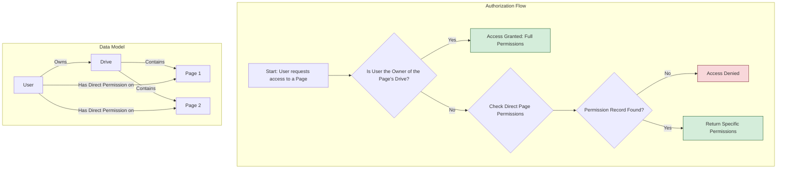

# Authorization & Permissions

This document provides a detailed explanation of the permissions and sharing model within the application. It is designed to be a comprehensive guide for developers and administrators on how access control is managed.

## 1. Core Concepts

The permissions system is built on three core concepts: **Ownership**, **Drive Membership**, and **Page Permissions**.

### 1.1. Ownership

*   **The `Drive` is the root of all ownership.** Every `Drive` has a single, designated `owner` (a `User`).
*   **The owner has ultimate power.** The owner of a `Drive` has irrevocable access to all operations on the `Drive` and all `Pages` within it. This is the highest possible level of access and cannot be overridden by any other permission setting.
*   **Source of Truth:** The `ownerId` field on the `Drive` model is the absolute source of truth for ownership.

### 1.2. Drive Membership

*   **Drive members have basic access.** Users can be added as members to a `Drive` through the `driveMembers` table with roles: `OWNER`, `ADMIN`, or `MEMBER`.
*   **Membership grants drive visibility.** Being a drive member gives basic access to view the drive and potentially access pages based on page-level permissions.
*   **Invitation system:** New members are invited through the `driveInvitations` table with email-based invitations.

### 1.3. Page Permissions

*   **Direct page-level permissions.** The current system uses direct user-to-page permissions stored in the `pagePermissions` table.
*   **Boolean permission flags:** Each permission record contains boolean flags for specific actions:
    *   `canView`: The user can view the page and its content.
    *   `canEdit`: The user can view and edit the page and its content.
    *   `canShare`: The user can view, edit, and manage the permissions for the page (i.e., share it with other users).
    *   `canDelete`: The user can move the page to the trash.
*   **No inheritance:** Unlike previous designs, the current implementation uses direct permissions only - no inheritance from parent pages.

---

## 2. Database Schema

The permissions system uses several key tables:

### 2.1. Core Tables

- **`drives`**: Contains drive information with `ownerId` field
- **`pages`**: Contains page information with `driveId` foreign key
- **`users`**: User accounts

### 2.2. Membership Tables

- **`driveMembers`**: Tracks drive membership with roles (`OWNER`, `ADMIN`, `MEMBER`)
- **`driveInvitations`**: Manages pending drive invitations
- **`userProfiles`**: Public user profiles for discovery

### 2.3. Permission Tables

- **`pagePermissions`**: Direct user-to-page permissions with boolean flags:
  - `pageId`: Reference to the page
  - `userId`: Reference to the user
  - `canView`: Boolean permission to view
  - `canEdit`: Boolean permission to edit
  - `canShare`: Boolean permission to share/manage permissions
  - `canDelete`: Boolean permission to delete
  - `grantedBy`: User who granted the permission
  - `grantedAt`: Timestamp when permission was granted
  - `expiresAt`: Optional expiration date
  - `note`: Optional note about the permission

### 2.4. Legacy Schema (No Longer Used)

The documentation previously described a more complex system with:
- `permissions` table with `PermissionAction` enum
- `SubjectType` enum
- Permission inheritance from parent pages

This legacy system has been replaced with the simpler direct permission model.

---

## 3. The Authorization Flow: How Access is Determined

When a user attempts to access a page, the system executes a simple algorithm to determine their access level. This logic is encapsulated in the `getUserAccessLevel` function.

### Step-by-Step Breakdown:

1.  **Check for Ownership (The Ultimate Override):** The system first checks if the user is the owner of the parent `Drive`. If they are, they are immediately granted full access (all permissions: view, edit, share, delete), and the process stops.
2.  **Check Direct Page Permissions:** If the user is not the owner, the system looks for a direct permission record in the `pagePermissions` table for this specific user and page.
3.  **Return Specific Permissions:** If a permission record is found, the system returns the exact boolean flags (canView, canEdit, canShare, canDelete) from that record.
4.  **No Permissions, No Access:** If no permission record is found, the user is denied access to the page.

### Example Scenario

Consider the following hierarchy: `Drive A (Owner: Alice)` -> `Folder X` -> `Document Y`.

1.  **Alice** requests `Document Y`.
    *   **Result:** Full access (canView: true, canEdit: true, canShare: true, canDelete: true). The system checks that Alice is the owner of `Drive A` and immediately grants full permissions.

2.  **Bob** requests `Document Y`. Bob has been granted direct permissions on `Document Y` with `canView: true, canEdit: true, canShare: false, canDelete: false`.
    *   **Result:** View and Edit access only. The system checks for ownership (false), then finds Bob's direct permission record on `Document Y` and returns those specific permissions.

3.  **Charlie** requests `Document Y`. Charlie has no direct permissions on `Document Y` but has permissions on `Folder X`.
    *   **Result:** Access denied. The current system does not support permission inheritance, so Charlie's permissions on `Folder X` do not grant access to `Document Y`.

---

## 4. API Routes

The permissions system is exposed through several API endpoints:

### 4.1. Page Permissions Management

**`GET /api/pages/[pageId]/permissions`**
- **Purpose:** Fetch all permissions for a specific page
- **Location:** [`apps/web/src/app/api/pages/[pageId]/permissions/route.ts:10`](apps/web/src/app/api/pages/[pageId]/permissions/route.ts:10)
- **Returns:** Drive owner info and list of user permissions
- **Auth Required:** Yes

**`POST /api/pages/[pageId]/permissions`**
- **Purpose:** Grant or update permissions for a user on a page
- **Location:** [`apps/web/src/app/api/pages/[pageId]/permissions/route.ts:95`](apps/web/src/app/api/pages/[pageId]/permissions/route.ts:95)
- **Body:** `{ userId, canView, canEdit, canShare, canDelete }`
- **Auth Required:** User must be owner or have share permission

**`DELETE /api/pages/[pageId]/permissions`**
- **Purpose:** Remove permissions for a user on a page
- **Location:** [`apps/web/src/app/api/pages/[pageId]/permissions/route.ts:194`](apps/web/src/app/api/pages/[pageId]/permissions/route.ts:194)
- **Body:** `{ userId }`
- **Auth Required:** User must be owner or have share permission

### 4.2. Drive Permission Tree

**`GET /api/drives/[driveId]/permissions-tree`**
- **Purpose:** Get hierarchical view of all pages with permission status for a user
- **Location:** [`apps/web/src/app/api/drives/[driveId]/permissions-tree/route.ts:20`](apps/web/src/app/api/drives/[driveId]/permissions-tree/route.ts:20)
- **Query Params:** `userId` (optional)
- **Auth Required:** Drive owner only

---

## 5. Core Functions

The core logic for the permissions system is located in `packages/lib/src/permissions.ts`.

### getUserAccessLevel(userId: string, pageId: string): Promise<object | null>
**Purpose:** The main authorization function; determines a user's access level for a page.
**Location:** [`packages/lib/src/permissions.ts:8`](packages/lib/src/permissions.ts:8)
**Returns:** `{ canView: boolean; canEdit: boolean; canShare: boolean; canDelete: boolean } | null`
**Dependencies:** Drizzle ORM
**Last Updated:** 2025-08-21

### canUserViewPage(userId: string, pageId: string): Promise<boolean>
**Purpose:** Check if user can view a specific page.
**Location:** [`packages/lib/src/permissions.ts:72`](packages/lib/src/permissions.ts:72)
**Dependencies:** `getUserAccessLevel`
**Last Updated:** 2025-08-21

### canUserEditPage(userId: string, pageId: string): Promise<boolean>
**Purpose:** Check if user can edit a specific page.
**Location:** [`packages/lib/src/permissions.ts:83`](packages/lib/src/permissions.ts:83)
**Dependencies:** `getUserAccessLevel`
**Last Updated:** 2025-08-21

### canUserSharePage(userId: string, pageId: string): Promise<boolean>
**Purpose:** Check if user can share a specific page.
**Location:** [`packages/lib/src/permissions.ts:94`](packages/lib/src/permissions.ts:94)
**Dependencies:** `getUserAccessLevel`
**Last Updated:** 2025-08-21

### canUserDeletePage(userId: string, pageId: string): Promise<boolean>
**Purpose:** Check if user can delete a specific page.
**Location:** [`packages/lib/src/permissions.ts:104`](packages/lib/src/permissions.ts:104)
**Dependencies:** `getUserAccessLevel`
**Last Updated:** 2025-08-21

### isUserDriveMember(userId: string, driveId: string): Promise<boolean>
**Purpose:** Check if user is a member of a drive (owner or explicit member).
**Location:** [`packages/lib/src/permissions.ts:116`](packages/lib/src/permissions.ts:116)
**Dependencies:** Drizzle ORM
**Last Updated:** 2025-08-21

### getUserAccessiblePagesInDrive(userId: string, driveId: string): Promise<string[]>
**Purpose:** Get all page IDs a user has access to within a drive.
**Location:** [`packages/lib/src/permissions.ts:145`](packages/lib/src/permissions.ts:145)
**Dependencies:** Drizzle ORM
**Last Updated:** 2025-08-21

### grantPagePermissions(pageId: string, userId: string, permissions: object, grantedBy: string): Promise<void>
**Purpose:** Grant or update permissions for a user on a specific page.
**Location:** [`packages/lib/src/permissions.ts:180`](packages/lib/src/permissions.ts:180)
**Dependencies:** Drizzle ORM
**Last Updated:** 2025-08-21

### revokePagePermissions(pageId: string, userId: string): Promise<void>
**Purpose:** Remove all permissions for a user on a specific page.
**Location:** [`packages/lib/src/permissions.ts:230`](packages/lib/src/permissions.ts:230)
**Dependencies:** Drizzle ORM
**Last Updated:** 2025-08-21

### getUserDriveAccess(userId: string, driveId: string): Promise<boolean>
**Purpose:** Check if user has any access to a drive (ownership or page permissions).
**Location:** [`packages/lib/src/permissions.ts:246`](packages/lib/src/permissions.ts:246)
**Dependencies:** Drizzle ORM
**Last Updated:** 2025-08-21

---

## 6. Key Changes from Previous Implementation

The current permissions system has been significantly simplified from the previous design:

### 6.1. Removed Features
- **Permission inheritance:** No walking up the page hierarchy to inherit permissions
- **Enum-based actions:** Replaced `PermissionAction` enum with boolean flags

### 6.2. Current Approach
- **Direct permissions only:** Each permission is a direct user-to-page relationship
- **Boolean flags:** Simple true/false for each permission type
- **Owner override:** Drive owners have implicit full access to all pages
- **Simplified queries:** No complex recursive CTEs or precedence resolution

### 6.3. Benefits
- **Performance:** Simpler queries with fewer joins and no recursion
- **Maintainability:** Easier to understand and debug
- **Flexibility:** Boolean flags allow precise control over each permission type
- **Scalability:** Direct lookups are more predictable than hierarchical inheritance

This simplified approach trades some advanced features (like inheritance) for better performance and maintainability.