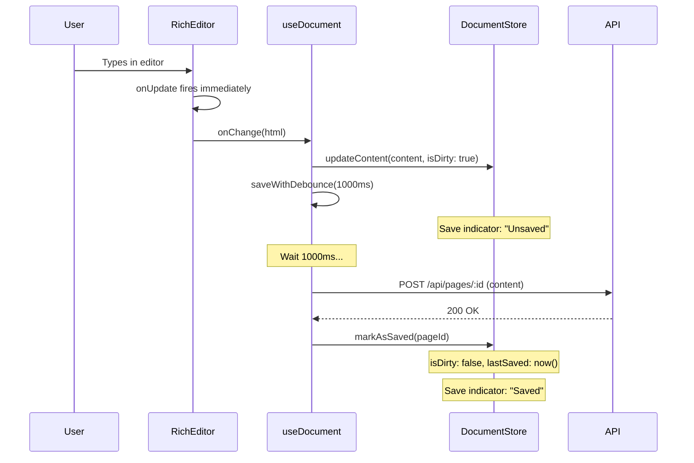
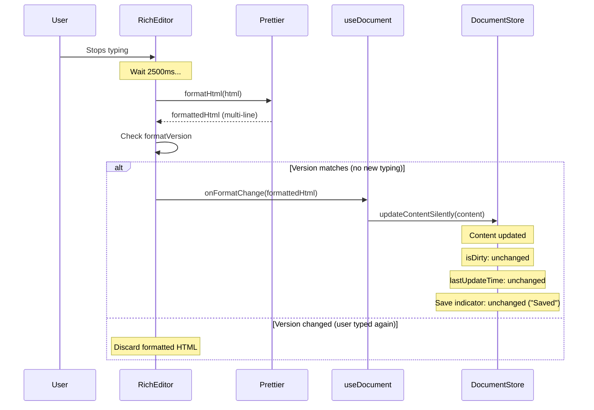
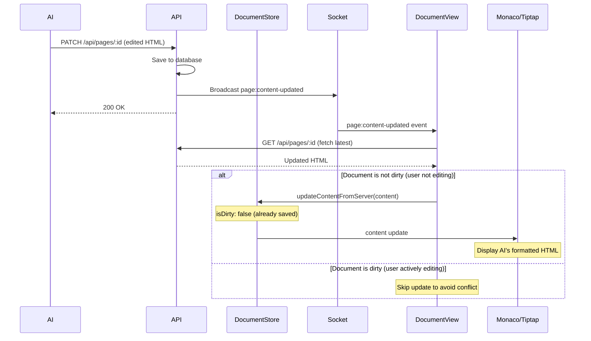

# Editor Architecture

This document provides a comprehensive overview of the editor architecture in PageSpace, detailing how the Tiptap (Rich Text) and Monaco (Code) editors work together with advanced state management to provide a seamless editing experience that supports both human users and AI collaboration.

## Table of Contents

1. [High-Level Overview](#high-level-overview)
2. [Core Architectural Principles](#core-architectural-principles)
3. [The Critical Role of Prettier in AI Editability](#the-critical-role-of-prettier-in-ai-editability)
4. [Dual-Editor System](#dual-editor-system)
5. [State Management Architecture](#state-management-architecture)
6. [Content Update Types](#content-update-types)
7. [Flow Diagrams](#flow-diagrams)
8. [Auto-Save Strategy](#auto-save-strategy)
9. [Real-Time Collaboration](#real-time-collaboration)
10. [Implementation Guide](#implementation-guide)

## High-Level Overview

The core of our editor system is the [`DocumentView.tsx`](../../../apps/web/src/components/layout/middle-content/page-views/document/DocumentView.tsx) component. It acts as the parent controller for two distinct editors and manages sophisticated document state through the `useDocument` hook.

### Two Editor Modes

Users can switch between two editor modes:

1. **Rich:** A WYSIWYG editor powered by [Tiptap](../2.5-integrations/tiptap.md) for familiar, user-friendly editing
2. **Code:** A raw HTML editor powered by [Monaco Editor](../2.5-integrations/monaco-editor.md) for direct HTML manipulation and AI collaboration

The architecture features advanced capabilities including:
- Real-time collaboration via Socket.IO
- Permission-based editing controls
- Debounced auto-save (1000ms)
- Intelligent content synchronization
- **AI-friendly HTML formatting via Prettier** (the critical foundation for AI collaboration)

## Core Architectural Principles

### 1. HTML as the Single Source of Truth

**All document content is stored and transmitted as HTML.** This is the fundamental principle that enables our dual-editor architecture:

- Tiptap serializes its internal state to HTML
- Monaco displays and edits HTML directly
- Database stores HTML
- AI receives and edits HTML
- Real-time sync transmits HTML

### 2. Prettier Formatting for AI Editability

**Prettier's role is not cosmetic—it's infrastructure for AI collaboration.**

Tiptap produces single-line HTML like this:
```html
<h1>Hello</h1><p>This is a <strong>paragraph</strong> with formatting.</p>
```

AI cannot reliably perform line-by-line edits on single-line HTML. Prettier transforms it into multi-line format:
```html
<h1>Hello</h1>
<p>
  This is a <strong>paragraph</strong> with formatting.
</p>
```

This enables AI to:
- Replace specific lines without parsing the entire document
- Add/remove content at precise locations
- Perform surgical edits without breaking HTML structure

### 3. Three Types of Content Updates

The system supports three distinct update pathways, each with different behavior:

| Update Type | Marks Dirty? | Triggers Save? | Use Case |
|-------------|--------------|----------------|----------|
| `updateContent()` | ✅ Yes | ✅ Yes (1000ms) | User edits in editor |
| `updateContentFromServer()` | ❌ No | ❌ No | External updates (AI, other users) |
| `updateContentSilently()` | ❌ No | ❌ No | Prettier formatting (cosmetic) |

This separation prevents save indicator flicker and ensures the "Saved" indicator accurately reflects user edit state.

### 4. Dual-Layer Debouncing

The system uses two independent debounce timers:

- **1000ms:** User edit auto-save (triggered by `onChange`)
- **2500ms:** Prettier formatting (triggered by `debouncedFormat`)

Both timers have cancellation logic to prevent stale operations when the user continues typing.

## The Critical Role of Prettier in AI Editability

### Why Prettier Formatting is Essential

**Without Prettier formatting, AI cannot reliably edit documents.** Here's why:

1. **Line-by-Line Replacement:** AI editing tools work by replacing specific line ranges. Single-line HTML makes this impossible.

2. **Structural Clarity:** Multi-line formatting makes HTML structure explicit, allowing AI to understand where elements begin and end.

3. **Reliable Parsing:** AI can identify specific elements by line number rather than character offset, which is more robust.

### The Formatting Pipeline

When a user edits content in Tiptap:

1. **Immediate User Edit:** User types → Tiptap `onUpdate` fires → `onChange(html)` called
2. **Immediate Save Trigger:** `updateContent()` marks as dirty → `saveWithDebounce(1000ms)` starts
3. **Delayed Formatting:** After 2500ms of inactivity → Prettier formats HTML → `onFormatChange(formattedHtml)` called
4. **Silent Update:** `updateContentSilently()` updates content **without** marking dirty or triggering save

### Cancellation Logic

Both timers have smart cancellation to prevent stale operations:

**User Edit Cancellation (1000ms):**
```typescript
// In useDocument.ts
const saveWithDebounce = useCallback((content: string, delay = 1000) => {
  const document = useDocumentManagerStore.getState().documents.get(pageId);
  if (document?.saveTimeout) {
    clearTimeout(document.saveTimeout); // Clear previous timer
  }
  const timeout = setTimeout(() => {
    saving.saveDocument(content).catch(console.error);
  }, delay);
  updateDocument(pageId, { saveTimeout: timeout });
}, [pageId, saving]);
```

**Prettier Format Cancellation (2500ms):**
```typescript
// In RichEditor.tsx
const debouncedFormat = useCallback((editor: Editor) => {
  if (formatTimeout.current) {
    clearTimeout(formatTimeout.current); // Clear previous timer
  }
  formatVersion.current++; // Increment version to invalidate in-flight formatting

  formatTimeout.current = setTimeout(async () => {
    const currentVersion = formatVersion.current;
    const html = editor.getHTML();
    const formattedHtml = await formatHtml(html);

    // Only apply formatting if:
    // 1. No new typing occurred (version matches)
    // 2. Formatting actually changed the content
    if (currentVersion === formatVersion.current && formattedHtml !== html) {
      if (onFormatChange) {
        onFormatChange(formattedHtml); // Silent update
      } else {
        onChange(formattedHtml); // Fallback (backward compatibility)
      }
    }
  }, 2500);
}, [onChange, onFormatChange]);
```

The `formatVersion` mechanism ensures that even if a format operation completes, it won't be applied if the user has started typing again.

## Dual-Editor System

### Architecture

The dual-editor system allows users to switch between WYSIWYG and code views while maintaining a single source of truth.

**Component Hierarchy:**
```
DocumentView.tsx (Parent Controller)
├── RichEditor.tsx (Tiptap)
│   ├── EditorContent (Tiptap component)
│   ├── BubbleMenu (formatting toolbar)
│   └── FloatingMenu (slash commands)
└── MonacoEditor.tsx (Monaco)
    └── Monaco.editor (code editor instance)
```

### Switching Between Editors

When the user switches views:

1. **Rich → Code:**
   - Tiptap's current HTML is passed to Monaco
   - Monaco displays the formatted HTML
   - User can edit HTML directly

2. **Code → Rich:**
   - Monaco's HTML is passed to Tiptap
   - Tiptap parses HTML and reconstructs its internal state
   - User sees rendered WYSIWYG view

**The content is always HTML.** The only difference is the UI representation.

### Editor-Specific Features

**RichEditor (Tiptap):**
- WYSIWYG editing with familiar UI
- BubbleMenu for text formatting (bold, italic, headings, etc.)
- FloatingMenu for slash commands (/, /h1, /h2, etc.)
- Extensions: StarterKit, Markdown, Placeholder, TextStyle, Table, CharacterCount, PageMention
- Placeholder text: "Start writing..."
- Character count displayed at bottom

**MonacoEditor:**
- HTML syntax highlighting
- Multi-line code editing
- Line numbers
- Search/replace (Cmd+F)
- Auto-indentation
- Bracket matching
- Language: `html`
- Theme: Integrated with app theme

## State Management Architecture

### The Single Source of Truth: `useDocumentManagerStore`

All document state is managed through a centralized Zustand store:

**File:** `apps/web/src/stores/useDocumentManagerStore.ts`

**State Structure:**
```typescript
interface DocumentState {
  id: string;                    // Page ID
  content: string;               // HTML content (always formatted)
  isDirty: boolean;              // Has unsaved changes?
  version: number;               // Version counter
  lastSaved: number;             // Timestamp of last successful save
  lastUpdateTime: number;        // Timestamp of last content update
  saveTimeout?: NodeJS.Timeout;  // Reference to active save timer
}

interface DocumentManagerState {
  documents: Map<string, DocumentState>;  // All open documents
  activeDocumentId: string | null;        // Currently active document
  savingDocuments: Set<string>;           // Documents currently being saved

  // Actions (see below)
}
```

### Store Actions

**Document Lifecycle:**
- `createDocument(pageId, initialContent)` - Create new document in store
- `updateDocument(pageId, updates)` - Update document properties
- `getDocument(pageId)` - Retrieve document by ID
- `clearDocument(pageId)` - Remove document from store
- `clearAllDocuments()` - Clear all documents

**Active Document Management:**
- `setActiveDocument(pageId)` - Set active document
- `getActiveDocument()` - Get currently active document

**Save State Management:**
- `markAsSaving(pageId)` - Add document to saving set
- `markAsSaved(pageId)` - Remove from saving set and update timestamps

### The `useDocument` Hook

**File:** `apps/web/src/hooks/useDocument.ts`

The `useDocument` hook provides a high-level API for components to interact with document state:

```typescript
const {
  document,                // Current document state
  isLoading,              // Loading from server?
  isSaving,               // Currently saving?
  initializeAndActivate,  // Initialize and fetch content
  updateContent,          // Update content (marks dirty, triggers save)
  updateContentFromServer, // Update from external source (no dirty)
  updateContentSilently,  // Update for formatting (no dirty, no save)
  saveWithDebounce,       // Debounced save (1000ms)
  forceSave,              // Immediate save
  clearDocument,          // Clear document from store
} = useDocument(pageId);
```

## Content Update Types

### 1. User Edits: `updateContent()`

**When:** User types in the editor, adds formatting, etc.

**Behavior:**
- ✅ Updates content in store
- ✅ Sets `isDirty: true`
- ✅ Updates `lastUpdateTime: Date.now()`
- ✅ Triggers `saveWithDebounce(1000ms)`

**Code:**
```typescript
// In DocumentView.tsx
const handleContentChange = useCallback((newContent: string | undefined) => {
  if (isReadOnly) {
    toast.error('You do not have permission to edit this document');
    return;
  }

  const content = newContent || '';

  // Update content (sets isDirty flag)
  updateContent(content);

  // Save timer - 1000ms debounced
  saveWithDebounce(content);
}, [updateContent, saveWithDebounce, isReadOnly]);
```

**Flow:**
```
User types → onChange() → updateContent() → isDirty: true → saveWithDebounce(1000ms)
                                                          ↓
                                              Save indicator: "Unsaved"
```

### 2. External Updates: `updateContentFromServer()`

**When:** AI edits, other users edit, real-time sync events

**Behavior:**
- ✅ Updates content in store
- ❌ Does **NOT** set `isDirty: true` (content is already saved on server)
- ✅ Updates `lastUpdateTime: Date.now()`
- ✅ Updates `lastSaved: Date.now()`
- ❌ Does **NOT** trigger save

**Code:**
```typescript
// In DocumentView.tsx
useEffect(() => {
  if (!socket) return;

  const handleContentUpdate = async (eventData: PageEventPayload) => {
    // Filter out self-triggered events
    if (eventData.socketId && eventData.socketId === socket.id) {
      return;
    }

    if (eventData.pageId === pageId) {
      try {
        const response = await fetchWithAuth(`/api/pages/${pageId}`);
        if (response.ok) {
          const updatedPage = await response.json();

          // Only update if not currently editing
          if (updatedPage.content !== documentState?.content && !documentState?.isDirty) {
            updateContentFromServer(updatedPage.content);
          }
        }
      } catch (error) {
        console.error('Failed to fetch updated content:', error);
      }
    }
  };

  socket.on('page:content-updated', handleContentUpdate);
  return () => socket.off('page:content-updated', handleContentUpdate);
}, [socket, pageId, documentState, updateContentFromServer]);
```

**Flow:**
```
External update → Socket event → Fetch latest → updateContentFromServer()
                                                            ↓
                                              isDirty: false (stays false)
                                              Save indicator: "Saved"
```

### 3. Prettier Formatting: `updateContentSilently()`

**When:** Prettier formats HTML after 2500ms of inactivity

**Behavior:**
- ✅ Updates content in store
- ❌ Does **NOT** set `isDirty: true`
- ❌ Does **NOT** update `lastUpdateTime` (keeps save validation working)
- ❌ Does **NOT** trigger save

**Code:**
```typescript
// In DocumentView.tsx
const handleFormatChange = useCallback((newContent: string | undefined) => {
  const content = newContent || '';
  updateContentSilently(content);
}, [updateContentSilently]);

// Passed to RichEditor
<RichEditor
  value={documentState?.content || ''}
  onChange={handleContentChange}        // User edits
  onFormatChange={handleFormatChange}   // Prettier formatting
  onEditorChange={setEditor}
  readOnly={isReadOnly}
/>
```

**Flow:**
```
User stops typing → 2500ms passes → Prettier formats → onFormatChange()
                                                              ↓
                                            updateContentSilently()
                                                              ↓
                                      Content updated, isDirty unchanged
                                      Save indicator: "Saved" (stays "Saved")
```

### Why Three Types?

**The Problem This Solves:**

Without `updateContentSilently()`, Prettier formatting would:
1. Call `onChange()` (treats formatting as user edit)
2. Mark document as dirty (`isDirty: true`)
3. Trigger auto-save (`saveWithDebounce()`)
4. User sees: **Saved → Unsaved → Saved** (flicker)

With `updateContentSilently()`:
1. Call `onFormatChange()` (separate callback)
2. Content updates **without** marking dirty
3. No save triggered
4. User sees: **Saved** (no flicker)

## Flow Diagrams

### 1. User Edit Flow



### 2. Prettier Formatting Flow (Silent Update)



### 3. AI Edit Flow



### 4. Complete Timeline: User Edit → Prettier → Save

```
Time  Event                          Action                        State
────────────────────────────────────────────────────────────────────────────────
0ms   User types "Hello"             onChange(html)                isDirty: true
                                     saveWithDebounce(1000ms)      Indicator: "Unsaved"
                                     debouncedFormat(2500ms)

1000ms Save debounce completes       API save                      Saving...
1050ms Save confirms                 markAsSaved()                 isDirty: false
                                                                   Indicator: "Saved"

2500ms Prettier debounce completes   formatHtml()                  (still working)
2600ms Prettier formatting done      onFormatChange()              Content updated
                                     updateContentSilently()       isDirty: false (unchanged!)
                                                                   Indicator: "Saved" ✅
```

**Without `updateContentSilently()` (old behavior):**
```
Time  Event                          Action                        State
────────────────────────────────────────────────────────────────────────────────
0ms   User types "Hello"             onChange(html)                isDirty: true
                                     saveWithDebounce(1000ms)      Indicator: "Unsaved"

1000ms Save completes                markAsSaved()                 isDirty: false
                                                                   Indicator: "Saved"

2500ms Prettier formats              onChange(formattedHtml) ❌    isDirty: true ❌
                                     saveWithDebounce(1000ms)      Indicator: "Unsaved" ❌

3500ms Unnecessary save              API save                      isDirty: false
                                                                   Indicator: "Saved"
```

The flicker: **Saved → Unsaved → Saved**

## Auto-Save Strategy

### Debounced Auto-Save (1000ms)

Every user edit triggers a debounced save with a 1-second delay:

```typescript
// In useDocument.ts
const saveWithDebounce = useCallback(
  (content: string, delay = 1000) => {
    const document = useDocumentManagerStore.getState().documents.get(pageId);
    if (document?.saveTimeout) {
      clearTimeout(document.saveTimeout); // Cancel previous save
    }

    const timeout = setTimeout(() => {
      saving.saveDocument(content).catch(console.error);
    }, delay);

    const updateDocument = useDocumentManagerStore.getState().updateDocument;
    updateDocument(pageId, { saveTimeout: timeout });
  },
  [pageId, saving]
);
```

**Behavior:**
- Each edit cancels the previous timer
- Only saves after 1 second of inactivity
- Prevents excessive API calls during continuous typing

### Force Save Triggers

The system also supports immediate saves (no debounce) in these scenarios:

#### 1. Keyboard Shortcut (Cmd+S / Ctrl+S)

```typescript
// In DocumentView.tsx
useEffect(() => {
  const handleKeyDown = (e: KeyboardEvent) => {
    if ((e.ctrlKey || e.metaKey) && e.key === 's') {
      e.preventDefault();
      forceSaveRef.current(); // Immediate save
    }
  };

  document.addEventListener('keydown', handleKeyDown);
  return () => document.removeEventListener('keydown', handleKeyDown);
}, []);
```

#### 2. Window Blur (User Switches Apps)

```typescript
// In DocumentView.tsx
useEffect(() => {
  const handleBlur = () => {
    if (isDirtyRef.current) {
      forceSaveRef.current().catch(console.error);
    }
  };

  window.addEventListener('blur', handleBlur);
  return () => window.removeEventListener('blur', handleBlur);
}, []);
```

#### 3. Component Unmount (User Navigates Away)

```typescript
// In DocumentView.tsx
useEffect(() => {
  return () => {
    if (isDirtyRef.current) {
      forceSaveRef.current().catch(console.error);
    }
  };
}, []); // Empty deps - only runs on unmount
```

### Save Conflict Prevention

When a save completes, the system checks if the user typed during the save operation:

```typescript
// In useDocument.ts
const saveDocument = useCallback(
  async (content: string) => {
    try {
      const saveStartTime = Date.now();
      markAsSaving(pageId);

      await patch(`/api/pages/${pageId}`, { content }, { headers });

      // Only mark as saved if content matches AND no updates during save
      const currentDoc = useDocumentManagerStore.getState().documents.get(pageId);

      if (currentDoc &&
          currentDoc.content === content &&
          currentDoc.lastUpdateTime < saveStartTime) {
        markAsSaved(pageId); // Safe to mark as saved
      } else {
        // Content changed while saving - remove from saving state but keep dirty
        const state = useDocumentManagerStore.getState();
        const newSaving = new Set(state.savingDocuments);
        newSaving.delete(pageId);
        useDocumentManagerStore.setState({ savingDocuments: newSaving });
      }

      return true;
    } catch (error) {
      console.error('Save failed:', error);
      toast.error('Failed to save document');
      // Remove from saving state but keep isDirty true
      throw error;
    }
  },
  [pageId, markAsSaving, markAsSaved, socket]
);
```

**This prevents:**
```
User types "A" → Save starts with "A" → User types "B" → Save completes
Result: Document marked as "Saved" even though "B" hasn't been saved yet ❌
```

**With conflict detection:**
```
User types "A" → Save starts with "A" → User types "B" → Save completes
Check: lastUpdateTime > saveStartTime → Keep as dirty, trigger another save ✅
```

## Real-Time Collaboration

### Socket.IO Integration

PageSpace uses Socket.IO for real-time collaboration. When a document is edited (by AI or another user), all connected clients receive updates.

**Event Flow:**

1. **User A edits document** → API saves → Socket broadcasts `page:content-updated`
2. **User B receives event** → Fetches latest content → Updates local state

### Conflict Resolution

To prevent overwriting user edits:

```typescript
// In DocumentView.tsx
const handleContentUpdate = async (eventData: PageEventPayload) => {
  // Filter out self-triggered events
  if (eventData.socketId && eventData.socketId === socket.id) {
    return; // This was our own edit
  }

  if (eventData.pageId === pageId) {
    try {
      const response = await fetchWithAuth(`/api/pages/${pageId}`);
      if (response.ok) {
        const updatedPage = await response.json();

        // Only update if not currently editing
        if (updatedPage.content !== documentState?.content && !documentState?.isDirty) {
          updateContentFromServer(updatedPage.content);
        }
      }
    } catch (error) {
      console.error('Failed to fetch updated content:', error);
    }
  }
};
```

**Protection Logic:**
- ✅ Apply updates when document is clean (`!isDirty`)
- ❌ Skip updates when user is actively editing (`isDirty`)
- ✅ Filter out self-triggered events (prevent loops)

### Socket ID in Save Requests

To prevent refetch loops, the save request includes the socket ID:

```typescript
// In useDocument.ts
const headers: Record<string, string> = {};
if (socket?.id) {
  headers['X-Socket-ID'] = socket.id;
}

await patch(`/api/pages/${pageId}`, { content }, { headers });
```

The API includes this socket ID in the broadcast:

```typescript
// In API route
await broadcastPageContentUpdate(page.id, socketId);
```

This allows clients to filter out their own events.

## Implementation Guide

### Creating a New Page View with Document Editing

If you're creating a new page type that needs document editing, follow this pattern:

#### 1. Set Up the Hook

```typescript
import { useDocument } from '@/hooks/useDocument';

const MyDocumentView = ({ pageId }: { pageId: string }) => {
  const {
    document: documentState,
    isLoading,
    initializeAndActivate,
    updateContent,
    updateContentFromServer,
    updateContentSilently,
    saveWithDebounce,
    forceSave,
  } = useDocument(pageId);

  // Initialize on mount
  useEffect(() => {
    initializeAndActivate();
  }, [pageId, initializeAndActivate]);
```

#### 2. Create Update Handlers

```typescript
  // User edits (marks dirty, triggers save)
  const handleContentChange = useCallback((newContent: string | undefined) => {
    const content = newContent || '';
    updateContent(content);
    saveWithDebounce(content);
  }, [updateContent, saveWithDebounce]);

  // Prettier formatting (silent update)
  const handleFormatChange = useCallback((newContent: string | undefined) => {
    const content = newContent || '';
    updateContentSilently(content);
  }, [updateContentSilently]);
```

#### 3. Register Editing State

```typescript
import { useEditingStore } from '@/stores/useEditingStore';

  // Register editing state when document is dirty
  useEffect(() => {
    const componentId = `document-${pageId}`;

    if (documentState?.isDirty && !isReadOnly) {
      useEditingStore.getState().startEditing(componentId, 'document', {
        pageId: pageId,
        componentName: 'MyDocumentView',
      });
    } else {
      useEditingStore.getState().endEditing(componentId);
    }

    return () => {
      useEditingStore.getState().endEditing(componentId);
    };
  }, [documentState?.isDirty, pageId, isReadOnly]);
```

**Why this matters:** The editing store prevents UI refreshes (SWR revalidation) while the user is editing. See [UI Refresh Protection](../../3.0-guides-and-tools/ui-refresh-protection.md) for details.

#### 4. Add Real-Time Sync (Optional)

```typescript
import { useSocket } from '@/hooks/useSocket';
import { PageEventPayload } from '@/lib/socket-utils';

  const socket = useSocket();

  useEffect(() => {
    if (!socket) return;

    const handleContentUpdate = async (eventData: PageEventPayload) => {
      if (eventData.socketId && eventData.socketId === socket.id) {
        return;
      }

      if (eventData.pageId === pageId) {
        try {
          const response = await fetchWithAuth(`/api/pages/${pageId}`);
          if (response.ok) {
            const updatedPage = await response.json();
            if (updatedPage.content !== documentState?.content && !documentState?.isDirty) {
              updateContentFromServer(updatedPage.content);
            }
          }
        } catch (error) {
          console.error('Failed to fetch updated content:', error);
        }
      }
    };

    socket.on('page:content-updated', handleContentUpdate);
    return () => socket.off('page:content-updated', handleContentUpdate);
  }, [socket, pageId, documentState, updateContentFromServer]);
```

#### 5. Add Force Save Triggers

```typescript
  // Save on window blur
  const isDirtyRef = useRef(false);
  const forceSaveRef = useRef(forceSave);

  useEffect(() => {
    forceSaveRef.current = forceSave;
  }, [forceSave]);

  useEffect(() => {
    isDirtyRef.current = documentState?.isDirty || false;
  }, [documentState?.isDirty]);

  useEffect(() => {
    const handleBlur = () => {
      if (isDirtyRef.current) {
        forceSaveRef.current().catch(console.error);
      }
    };

    window.addEventListener('blur', handleBlur);
    return () => window.removeEventListener('blur', handleBlur);
  }, []);

  // Save on unmount
  useEffect(() => {
    return () => {
      if (isDirtyRef.current) {
        forceSaveRef.current().catch(console.error);
      }
    };
  }, []);

  // Save on Cmd+S
  useEffect(() => {
    const handleKeyDown = (e: KeyboardEvent) => {
      if ((e.ctrlKey || e.metaKey) && e.key === 's') {
        e.preventDefault();
        forceSaveRef.current();
      }
    };

    document.addEventListener('keydown', handleKeyDown);
    return () => document.removeEventListener('keydown', handleKeyDown);
  }, []);
```

#### 6. Render the Editor

```typescript
  return (
    <div className="h-full flex flex-col">
      {activeView === 'rich' ? (
        <RichEditor
          value={documentState?.content || ''}
          onChange={handleContentChange}
          onFormatChange={handleFormatChange}
          onEditorChange={setEditor}
          readOnly={isReadOnly}
        />
      ) : (
        <MonacoEditor
          value={documentState?.content || ''}
          onChange={handleContentChange}
          language="html"
          readOnly={isReadOnly}
        />
      )}
    </div>
  );
};
```

### Key Files Reference

**State Management:**
- `apps/web/src/stores/useDocumentManagerStore.ts` - Centralized document state
- `apps/web/src/hooks/useDocument.ts` - High-level document operations hook
- `apps/web/src/stores/useEditingStore.ts` - UI refresh protection

**Components:**
- `apps/web/src/components/layout/middle-content/page-views/document/DocumentView.tsx` - Parent controller
- `apps/web/src/components/editors/RichEditor.tsx` - Tiptap WYSIWYG editor
- `apps/web/src/components/editors/MonacoEditor.tsx` - Monaco code editor
- `apps/web/src/components/editors/Toolbar.tsx` - Rich editor toolbar

**Utilities:**
- `apps/web/src/lib/editor/prettier.ts` - HTML formatting for AI editability
- `apps/web/src/lib/editor/tiptap-mention-config.ts` - Page mention (@page) extension
- `apps/web/src/lib/socket-utils.ts` - Real-time event utilities

### Common Patterns

#### Detecting Save State for UI Indicators

```typescript
const { document, isSaving } = useDocument(pageId);

const saveStatus = useMemo(() => {
  if (isSaving) return 'Saving...';
  if (document?.isDirty) return 'Unsaved';
  return 'Saved';
}, [document?.isDirty, isSaving]);

return <div className="save-indicator">{saveStatus}</div>;
```

#### Preventing Navigation During Edits

```typescript
import { useEditingStore } from '@/stores/useEditingStore';

const isEditing = useEditingStore(state => state.isAnyActive());

useEffect(() => {
  const handleBeforeUnload = (e: BeforeUnloadEvent) => {
    if (isEditing) {
      e.preventDefault();
      e.returnValue = '';
    }
  };

  window.addEventListener('beforeunload', handleBeforeUnload);
  return () => window.removeEventListener('beforeunload', handleBeforeUnload);
}, [isEditing]);
```

#### Checking if Specific Document is Dirty

```typescript
import { useDocumentManagerStore } from '@/stores/useDocumentManagerStore';

const isDirty = useDocumentManagerStore(
  useCallback((state) => state.documents.get(pageId)?.isDirty || false, [pageId])
);
```

## Summary

The PageSpace editor architecture provides:

1. **AI-Friendly HTML Formatting:** Prettier transforms single-line HTML into multi-line format, enabling AI to perform line-by-line edits reliably.

2. **Dual-Editor System:** Seamless switching between Tiptap (WYSIWYG) and Monaco (code) with HTML as the single source of truth.

3. **Three Types of Content Updates:**
   - `updateContent()` - User edits (marks dirty, triggers save)
   - `updateContentFromServer()` - External updates (no dirty flag)
   - `updateContentSilently()` - Formatting updates (no dirty flag, no save)

4. **Smart Debouncing:** Independent 1000ms (save) and 2500ms (format) timers with cancellation logic prevent excessive operations.

5. **Robust Auto-Save:** Multiple save triggers (debounce, Cmd+S, window blur, unmount) prevent data loss.

6. **Real-Time Collaboration:** Socket.IO integration with conflict resolution prevents overwriting user edits.

7. **Permission-Based Editing:** Dynamic read-only mode based on user permissions.

This architecture enables a seamless editing experience for human users while providing AI with structured, editable HTML that supports reliable programmatic modifications.

**Last Updated:** 2025-01-17
