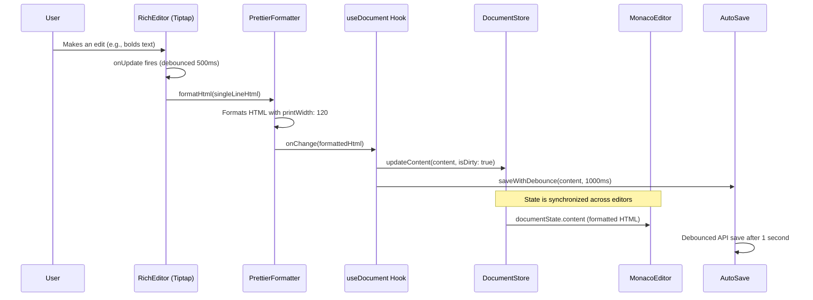

# Editor Architecture

This document provides a comprehensive overview of the editor architecture in pagespace, detailing how the Tiptap (Rich Text) and Monaco (Code) editors work together with advanced state management to provide a seamless and robust editing experience.

## High-Level Overview

The core of our editor system is the [`DocumentView.tsx`](apps/web/src/components/layout/middle-content/page-views/document/DocumentView.tsx:1) component. It acts as the parent controller for our two distinct editors and manages sophisticated document state through the `useDocument` hook.

The user can switch between two editor modes:

1.  **Rich:** A WYSIWYG editor powered by [Tiptap](../2.5-integrations/tiptap.md).
2.  **Code:** A raw HTML editor powered by [Monaco Editor](../2.5-integrations/monaco-editor.md).

The architecture features advanced capabilities including real-time collaboration, permission-based editing, auto-save functionality, and intelligent content synchronization made possible by our [Prettier integration](../2.5-integrations/prettier.md).

## Advanced State Management Architecture

### Document State Management with `useDocument` Hook

The [`DocumentView`](apps/web/src/components/layout/middle-content/page-views/document/DocumentView.tsx:1) component uses the sophisticated `useDocument` hook which provides:

-   **Centralized State:** Document state is managed through `useDocumentManagerStore` with multiple documents support
-   **Dirty State Tracking:** Tracks unsaved changes with `isDirty` flag
-   **Auto-save with Debouncing:** 1-second debounced saves prevent excessive API calls
-   **Force Save:** Immediate save capability for Ctrl+S shortcuts and window blur events
-   **Server Sync:** Handles content updates from external sources (AI, other users)

### Key State Management Features

-   **Optimistic Updates:** Content changes are immediately reflected in the UI before server confirmation
-   **Real-time Collaboration:** Socket.IO integration for live content updates from other users
-   **Permission System:** Dynamic read-only mode based on user permissions
-   **Auto-save Events:** Saves on window blur, keyboard shortcuts, and component unmount
-   **Error Handling:** Graceful fallback when saves fail with user notifications

## Content Flow and Prettier Integration

The critical challenge in this architecture is that Tiptap produces minified, single-line HTML, while Monaco is designed for multi-line code editing. Our solution formats Tiptap's output through Prettier *before* it reaches the document state.

### The Prettier Formatting Pipeline

When content changes in the Rich Editor:

1. **Tiptap `onUpdate`** fires with single-line HTML
2. **Debounced Handler** (500ms) prevents excessive formatting
3. **`formatHtml`** utility formats HTML using Prettier with `printWidth: 120`
4. **Document State Update** receives clean, formatted HTML
5. **Monaco Editor** displays properly formatted, readable code

Here is the end-to-end data flow:

### Key Architecture Principles:

1.  **Dual-Layer Debouncing:** 500ms debounce for formatting + 1000ms for auto-save prevents excessive operations
2.  **Always-Clean State:** Document state never contains minified HTML - only formatted content
3.  **Optimistic Updates:** UI updates immediately while saves happen in background
4.  **Real-time Sync:** Socket.IO handles external content updates without conflicts
5.  **Permission-Aware:** Read-only mode dynamically disables editing based on user permissions
6.  **Robust Auto-save:** Multiple save triggers (blur, shortcuts, unmount) prevent data loss

### Advanced Features

#### Real-time Collaboration
- Socket.IO integration for live content updates
- Conflict resolution prevents overwriting user changes
- Only updates when document isn't dirty (being edited)

#### Permission System
- Dynamic permission checking on component mount
- Read-only mode with visual indicators
- Prevents saves and shows appropriate error messages

#### Auto-save Strategy
- **Debounced saves:** 1-second delay after content changes
- **Force saves:** Ctrl+S, window blur, component unmount
- **Error handling:** Graceful fallback with user notifications
- **Dirty state tracking:** Visual indicators for unsaved changes

**Last Updated:** 2025-08-21
