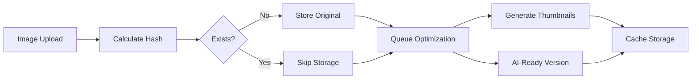
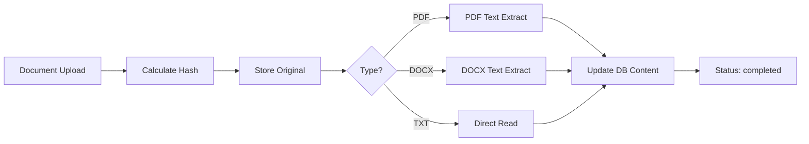

# File Upload and Processing System

## Overview

PageSpace implements a distributed file processing architecture that separates file handling concerns across multiple services for optimal performance and scalability.

### Key Design Principles

1. **Content-Addressed Storage**: Files are stored by their SHA256 hash for automatic deduplication
2. **Microservice Architecture**: Processing is isolated in a separate service for memory management
3. **Read-Only Files**: Uploaded files are immutable - content cannot be edited via AI tools
4. **Processing Status Tracking**: Files have clear status states (pending, visual, completed, failed)

## Architecture Components

### Web Application (`apps/web`)
- **Role**: User interface, API endpoints, authentication
- **Memory**: 768MB allocated
- **Key Responsibilities**:
  - Accept file uploads from users
  - Forward files to processor service
  - Serve file metadata to clients
  - Manage permissions and access control

### Processor Service (`apps/processor`)
- **Role**: File processing, storage, and optimization
- **Memory**: 1280MB allocated
- **Key Responsibilities**:
  - Store original files
  - Generate optimized versions (thumbnails, AI-ready images)
  - Extract text from documents
  - Serve files via HTTP endpoints

### PostgreSQL Database
- **Role**: Metadata storage and content indexing
- **Stores**:
  - File metadata (size, type, original name)
  - Processing status
  - Extracted text content
  - Content hashes for deduplication

## Supported File Types

### Images (Visual Processing)
| Type | MIME Type | Processing | Status |
|------|-----------|------------|--------|
| PNG | image/png | ✅ Optimization, thumbnails | `visual` |
| JPEG | image/jpeg, image/jpg | ✅ Optimization, thumbnails | `visual` |
| GIF | image/gif | ✅ Optimization, thumbnails | `visual` |
| WebP | image/webp | ✅ Optimization, thumbnails | `visual` |
| BMP | image/bmp | ✅ Optimization, thumbnails | `visual` |
| TIFF | image/tiff | ✅ Optimization, thumbnails | `visual` |
| SVG | image/svg+xml | ✅ Pass-through | `visual` |

### Documents (Text Extraction)
| Type | MIME Type | Processing | Status |
|------|-----------|------------|--------|
| PDF | application/pdf | ⚠️ Text extraction planned | `pending` |
| DOCX | application/vnd.openxmlformats-officedocument.wordprocessingml.document | ⚠️ Text extraction planned | `pending` |
| TXT | text/plain | ✅ Direct content read | `completed` |
| MD | text/markdown | ✅ Direct content read | `completed` |

### Not Implemented
- Excel files (XLSX)
- PowerPoint files (PPTX)
- Video files
- Audio files
- Archive files (ZIP, RAR)

## Upload Flow

### 1. Client Upload Request
```typescript
POST /api/upload
FormData: {
  file: File,
  driveId: string,
  parentId?: string,
  title?: string,
  position?: string
}
```

### 2. Web App Processing
1. Verify authentication
2. Validate file size (max 100MB)
3. Sanitize filename (remove Unicode spaces)
4. Forward to processor service
5. Create database entry with appropriate status:
   - Images → 'visual'
   - Documents → 'pending' (awaiting text extraction)
6. Enqueue processing jobs if needed

### 3. Processor Service Handling
1. Calculate SHA256 content hash
2. Check for existing file (deduplication)
3. Store original at: `/data/files/{contentHash}/original`
4. Save metadata: `/data/files/{contentHash}/metadata.json`
5. Queue processing jobs:
   - Image optimization (ai-chat, thumbnail presets)
   - Text extraction (if applicable)
   - OCR processing (if enabled)

### 4. Database Storage
```sql
-- Table: pages
id: string (cuid2)
title: string
type: 'FILE'
content: text (extracted content or empty)
processingStatus: 'pending' | 'visual' | 'completed' | 'failed'
filePath: string (content hash)
mimeType: string
fileSize: bigint
originalFileName: string
fileMetadata: jsonb
```

## Processing Pipeline

### Image Processing Pipeline


**Image Presets**:
```typescript
'ai-chat': { maxWidth: 1920, quality: 85, format: 'jpeg' }
'ai-vision': { maxWidth: 2048, quality: 90, format: 'jpeg' }
'thumbnail': { maxWidth: 200, maxHeight: 200, quality: 80, format: 'webp' }
'preview': { maxWidth: 800, quality: 85, format: 'jpeg' }
```

### Document Processing Pipeline


**Current Status**: ⚠️ Text extraction not fully implemented
- PDF extraction planned using pdf-parse
- DOCX extraction planned using mammoth
- Worker service exists but minimal implementation

## Storage Architecture

### Directory Structure
```
/data/files/
├── {contentHash1}/
│   ├── original          # Original uploaded file
│   └── metadata.json     # File metadata
├── {contentHash2}/
│   ├── original
│   └── metadata.json
└── ...

/data/cache/
├── {contentHash1}/
│   ├── ai-chat.jpg       # Optimized for AI
│   ├── thumbnail.webp    # Thumbnail version
│   └── metadata.json     # Cache metadata
└── ...
```

### Content-Addressed Storage
- Files named by SHA256 hash of contents
- Automatic deduplication - identical files share storage
- Immutable - files never change once stored
- Metadata preserved separately

## File Access Patterns

### Viewing Files (Web App)
```typescript
GET /api/files/{pageId}/view
1. Verify authentication
2. Check permissions
3. Fetch from processor: http://processor:3003/cache/{contentHash}/original
4. Stream to client with appropriate headers
```

### Serving Files (Processor)
```typescript
GET /cache/{contentHash}/original     # Original file
GET /cache/{contentHash}/{preset}     # Optimized version
GET /cache/{contentHash}/metadata     # File metadata
```

### AI Vision Access
```typescript
loadVisualContent():
1. Fetch from processor using content hash
2. Check file size limits (10MB max)
3. Return base64 or URL based on provider
4. Optimize for specific AI provider if needed
```

## AI Integration

### Reading Files
```typescript
read_page tool:
- Check processingStatus
- 'visual' → Load image data for vision models
- 'completed' → Return extracted text content
- 'pending' → Return "still processing" error
```

### File Immutability
All editing tools check:
```typescript
if (page.type === 'FILE') {
  return { error: 'Cannot edit FILE pages' }
}
```

**Protected Operations**:
- replace_lines (use empty content to delete lines)

### Vision Model Support
1. Check if model has vision capabilities
2. Load visual content from processor
3. Convert to base64 or URL based on provider
4. Include in AI context with proper formatting

## Known Limitations

### What Works ✅
1. **Image Upload & Display**
   - Upload via web interface
   - Deduplication by content hash
   - Serving via processor endpoints
   - AI vision model integration

2. **Basic File Management**
   - File metadata storage
   - Permission checking
   - Trash/restore operations
   - Move/rename operations

3. **Memory Optimization**
   - Isolated processor service
   - Streaming for large files
   - Content-addressed storage

### What Doesn't Work ❌
1. **Text Extraction**
   - PDF text extraction not implemented
   - DOCX text extraction not implemented
   - OCR processing not connected

2. **Advanced Processing**
   - No virus scanning
   - No file compression
   - No video thumbnail generation
   - No metadata extraction (EXIF, etc.)

3. **Scale Limitations**
   - Single processor instance
   - No distributed storage
   - No CDN integration
   - 100MB file size limit

### Partial Implementation ⚠️
1. **Worker Service**
   - Queue infrastructure exists
   - pg-boss integration ready
   - Processing logic minimal

2. **Progress Tracking**
   - Status field exists
   - No real-time progress updates
   - No retry mechanism for failures

## Security Considerations

### Current Implementation
1. **Authentication Required**: All file operations require valid JWT
2. **Permission Checks**: Drive-based access control
3. **File Type Validation**: MIME type checking
4. **Size Limits**: 100MB maximum file size
5. **Read-Only Files**: Uploaded files cannot be modified

### Security Gaps
1. **No Virus Scanning**: Files not scanned for malware
2. **No Content Validation**: Files not checked for malicious content
3. **Path Traversal**: Relies on content hash, reducing risk
4. **No Rate Limiting**: Upload spam possible
5. **No Encryption**: Files stored unencrypted

## Deployment Notes

### Docker Volumes
```yaml
volumes:
  file_storage:    # Shared between web and worker
  cache_storage:   # Processor cache directory
```

### Permission Requirements
- Processor runs as user 1000 (node)
- Volumes initialized with correct permissions
- Permission fixer service runs on startup

### Memory Allocation
- **Web**: 768MB (reduced from 1280MB)
- **Processor**: 1280MB (handles heavy processing)
- **Worker**: 256MB (minimal current usage)
- **Realtime**: 256MB
- **PostgreSQL**: System managed

## Future Enhancements

### High Priority
1. Implement PDF text extraction
2. Implement DOCX text extraction
3. Add progress tracking for long operations
4. Implement retry mechanism for failed jobs

### Medium Priority
1. Add virus scanning
2. Implement OCR for scanned documents
3. Add EXIF metadata extraction
4. Support larger file sizes (chunked upload)

### Low Priority
1. Video thumbnail generation
2. Audio transcription
3. Archive file preview
4. CDN integration for serving

## Troubleshooting

### Common Issues

1. **"EISDIR: illegal operation on a directory"**
   - Cause: File system mismatch between services
   - Solution: Ensure processor service is running and accessible

2. **Files stuck in "pending" status**
   - Cause: Text extraction not implemented
   - Solution: Manually update DB or wait for implementation

3. **"File not found" errors**
   - Cause: File exists in different storage location
   - Solution: Check both /app/storage and /data/files

4. **Permission denied errors**
   - Cause: Docker volume permissions
   - Solution: Run permission fixer service

5. **Memory issues during processing**
   - Cause: Large files or many concurrent operations
   - Solution: Adjust memory limits or implement queuing

## Testing Checklist

### Upload Testing
- [ ] Upload PNG image < 10MB
- [ ] Upload JPEG image < 10MB
- [ ] Upload PDF document
- [ ] Upload DOCX document
- [ ] Upload 100MB file (should fail)
- [ ] Upload duplicate file (should deduplicate)

### Processing Testing
- [ ] Verify image status becomes 'visual'
- [ ] Verify AI can read image files
- [ ] Verify thumbnail generation
- [ ] Check document status (currently 'pending')

### Access Testing
- [ ] View uploaded image
- [ ] Download original file
- [ ] AI vision model reads image
- [ ] AI cannot edit file content
- [ ] Permission checks work correctly

### Integration Testing
- [ ] Upload via web interface
- [ ] File appears in file browser
- [ ] AI can list files
- [ ] AI can read file metadata
- [ ] File can be moved/renamed
- [ ] File can be trashed/restored