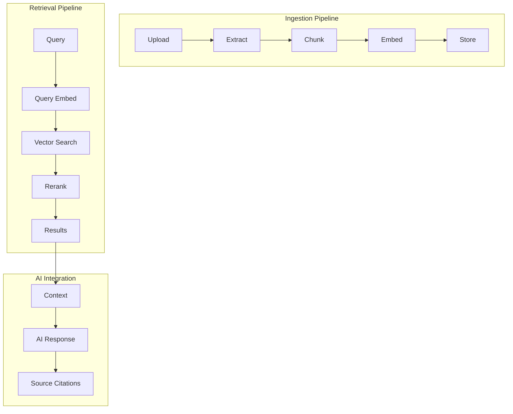

# PageSpace RAG Implementation & Architecture Guide

## Table of Contents
1. [Introduction](#introduction)
2. [Current PageSpace Architecture](#current-pagespace-architecture)
3. [File Management System Analysis](#file-management-system-analysis)
4. [RAG System Design](#rag-system-design)
5. [Implementation Roadmap](#implementation-roadmap)
6. [Technical Implementation Details](#technical-implementation-details)
7. [Performance Considerations](#performance-considerations)
8. [Future Enhancements](#future-enhancements)
9. [Appendix: Technical References](#appendix-technical-references)

---

## Introduction

PageSpace is a local-first, AI-powered document management system that combines the flexibility of a wiki with the intelligence of modern AI systems. This guide provides a comprehensive overview of implementing Retrieval-Augmented Generation (RAG) capabilities to make uploaded files searchable and queryable through semantic search.

### Document Purpose
- **Primary Goal**: Define the architecture and implementation strategy for RAG in PageSpace
- **Audience**: Developers, architects, and AI engineers working on PageSpace
- **Scope**: Complete RAG system from file upload to AI-powered search and retrieval

### Key Objectives
1. Enable semantic search across all uploaded documents
2. Maintain local-first architecture with no cloud dependencies
3. Integrate seamlessly with existing AI chat capabilities
4. Provide sub-second search response times
5. Support multiple file formats with high-quality text extraction

---

## Current PageSpace Architecture

### Technology Stack Overview

#### Core Technologies
- **Framework**: Next.js 15.3.5 with App Router
- **Language**: TypeScript 5.8.3
- **Database**: PostgreSQL with Drizzle ORM
- **AI Runtime**: Ollama (local models) + Vercel AI SDK
- **Authentication**: Custom JWT with jose
- **Real-time**: Socket.IO for collaboration
- **Deployment**: Docker containers on local infrastructure

#### Monorepo Structure
```
PageSpace/
├── apps/
│   ├── web/          # Next.js application
│   └── realtime/     # Socket.IO service
├── packages/
│   ├── db/           # Drizzle ORM & schemas
│   └── lib/          # Shared utilities & types
```

### Current File Handling System

#### Upload Flow (`/api/upload/route.ts`)
```typescript
// Current implementation
1. Authenticate user
2. Process multipart form data
3. Store file on filesystem
4. Create page entry with metadata
5. Return page object
```

**Supported File Types**: 44+ formats including:
- Documents: PDF, DOCX, TXT, MD
- Images: PNG, JPG, GIF, SVG
- Code: JS, TS, PY, GO, RUST
- Data: JSON, CSV, XML

**Storage Configuration**:
- Local filesystem storage
- Configurable path via `FILE_STORAGE_PATH`
- 100MB file size limit
- Metadata stored in PostgreSQL

#### Database Schema for Files
```sql
-- Current pages table (relevant fields)
pages (
  id UUID PRIMARY KEY,
  type PageType, -- includes 'FILE'
  title TEXT,
  content TEXT,
  fileSize REAL,
  mimeType TEXT,
  originalFileName TEXT,
  filePath TEXT,
  fileMetadata JSONB,
  driveId UUID,
  parentId UUID,
  createdAt TIMESTAMP,
  updatedAt TIMESTAMP
)
```

### Existing Search Capabilities

#### Text-Based Search Tools (`/lib/ai/tools/search-tools.ts`)

**1. Regex Search Tool**
```typescript
- Pattern-based search using PostgreSQL regex
- Searches content and titles
- Returns matched pages with highlights
- Permission-aware results
```

**2. Glob Search Tool**
```typescript
- File/folder pattern matching
- Hierarchical path searching
- Drive-scoped searches
- Returns matching page structures
```

**3. Multi-Drive Search**
```typescript
- Cross-workspace text search
- PostgreSQL ILIKE queries
- Combines results from multiple drives
- Respects user permissions
```

**Current Limitations**:
- No semantic understanding
- No content extraction from binary files
- No vector/embedding-based search
- Limited to exact or pattern matching

### AI Integration Architecture

#### Provider Support
```typescript
// Current AI providers
- Ollama (local): llama3, codellama, mistral
- OpenRouter: Access to 100+ models
- Google AI: Gemini models
- Anthropic: Claude models
```

#### AI Tools System (`/lib/ai/ai-tools.ts`)
- Comprehensive tool suite for AI operations
- Page reading, writing, and manipulation
- Batch operations support
- Permission-aware tool execution
- Streaming response capabilities

---

## File Management System Analysis

### Current State Assessment

#### Strengths
1. **Robust Upload System**: Handles multiple file types with proper validation
2. **Permission System**: Comprehensive RBAC with drive-level access control
3. **Metadata Storage**: Rich metadata captured in PostgreSQL
4. **File Organization**: Hierarchical structure with parent-child relationships
5. **Local-First**: No external dependencies for file storage

#### Gaps for RAG Implementation
1. **No Content Extraction**: Binary files remain opaque to search
2. **No Vector Storage**: Missing embedding infrastructure
3. **No Semantic Search**: Only keyword/pattern matching available
4. **No Chunking Strategy**: Large documents not segmented
5. **No Background Processing**: No async job queue for heavy operations

### File Viewer Components Analysis

#### Current Viewers (`/components/layout/middle-content/page-views/file/`)

**PDFViewer.tsx**
```typescript
// Current: iframe display only
// Needed: Text extraction capability
```

**CodeViewer.tsx**
```typescript
// Current: Full content loading
// Ready for: Direct indexing
```

**ImageViewer.tsx**
```typescript
// Current: Visual display only
// Needed: OCR capability (future)
```

### Required Enhancements

#### Infrastructure Needs
1. Vector database capability (pgvector)
2. Embedding model integration
3. Text extraction pipeline
4. Background job processing
5. Caching layer for embeddings

#### Data Pipeline Requirements


---

## RAG System Design

### Architecture Overview

#### High-Level Design


### Core Components

#### 1. Document Processing Pipeline

**Text Extraction Service**
```typescript
interface ExtractionService {
  extractPDF(buffer: Buffer): Promise<ExtractedContent>
  extractDOCX(buffer: Buffer): Promise<ExtractedContent>
  extractCode(content: string): Promise<ExtractedContent>
  extractMarkdown(content: string): Promise<ExtractedContent>
}
```

**Chunking Strategy**
```typescript
interface ChunkingConfig {
  maxTokens: 800        // Optimal for context windows
  overlap: 0.1          // 10% overlap between chunks
  method: 'paragraph'   // Paragraph-aware splitting
  preserveStructure: true
}
```

#### 2. Embedding Generation

**Model Selection**
```typescript
// Recommended Ollama models
const EMBEDDING_MODELS = {
  fast: 'all-minilm:latest',      // 384 dimensions, fastest
  balanced: 'nomic-embed-text',    // 768 dimensions, recommended
  quality: 'mxbai-embed-large'     // 1024 dimensions, highest quality
}
```

**Embedding Service**
```typescript
interface EmbeddingService {
  generateEmbedding(text: string): Promise<number[]>
  batchGenerate(texts: string[]): Promise<number[][]>
  model: string
  dimensions: number
}
```

#### 3. Vector Storage

**Database Schema Extension**
```sql
-- Enable pgvector extension
CREATE EXTENSION IF NOT EXISTS vector;

-- Document chunks table
CREATE TABLE document_chunks (
  id SERIAL PRIMARY KEY,
  page_id UUID REFERENCES pages(id) ON DELETE CASCADE,
  chunk_index INTEGER NOT NULL,
  content TEXT NOT NULL,
  embedding vector(768),
  metadata jsonb DEFAULT '{}',
  search_vector tsvector GENERATED ALWAYS AS (to_tsvector('english', content)) STORED,
  created_at TIMESTAMP DEFAULT NOW(),
  updated_at TIMESTAMP DEFAULT NOW()
);

-- Indexes for performance
CREATE INDEX idx_chunks_page_id ON document_chunks(page_id);
CREATE INDEX idx_chunks_search ON document_chunks USING GIN(search_vector);
-- Add HNSW index later when needed (>10k chunks)
-- CREATE INDEX idx_chunks_embedding ON document_chunks USING hnsw (embedding vector_cosine_ops);

-- Processing status tracking
CREATE TABLE processing_jobs (
  id SERIAL PRIMARY KEY,
  page_id UUID REFERENCES pages(id),
  status VARCHAR(50) DEFAULT 'pending',
  job_type VARCHAR(50),
  error TEXT,
  metadata jsonb DEFAULT '{}',
  created_at TIMESTAMP DEFAULT NOW(),
  completed_at TIMESTAMP
);
```

#### 4. Search Implementation

**Hybrid Search Algorithm**
```typescript
interface SearchStrategy {
  // Combine keyword and vector search
  async hybridSearch(query: string, options: SearchOptions): Promise<SearchResult[]> {
    const [keywordResults, vectorResults] = await Promise.all([
      this.keywordSearch(query, options),
      this.vectorSearch(query, options)
    ]);
    
    return this.fuseResults(keywordResults, vectorResults, {
      keywordWeight: 0.3,
      vectorWeight: 0.7
    });
  }
  
  // Reciprocal Rank Fusion for result merging
  fuseResults(keyword: Result[], vector: Result[], weights: Weights): Result[]
}
```

### Integration Points

#### 1. File Upload Enhancement
```typescript
// Enhanced upload flow
async function handleFileUpload(file: File, userId: string) {
  // 1. Original upload logic
  const page = await createFilePage(file, userId);
  
  // 2. Queue extraction job
  await queueJob({
    type: 'extract_content',
    pageId: page.id,
    mimeType: file.type
  });
  
  return page;
}
```

#### 2. AI Chat Integration
```typescript
// RAG-enhanced chat
async function handleChatMessage(message: string, userId: string) {
  // 1. Retrieve relevant documents
  const context = await retrieveContext(message, {
    userId,
    limit: 5,
    threshold: 0.7
  });
  
  // 2. Augment prompt with context
  const augmentedPrompt = buildRAGPrompt(message, context);
  
  // 3. Generate response with citations
  const response = await generateAIResponse(augmentedPrompt);
  
  return {
    response,
    sources: context.map(c => c.source)
  };
}
```

---

## Implementation Roadmap

### Phase 1: Foundation (Days 1-2)

#### Database Setup
- [ ] Install pgvector extension
- [ ] Create migration files in Drizzle
- [ ] Add document_chunks table
- [ ] Set up processing_jobs table
- [ ] Create initial indexes

#### Background Processing
- [ ] Install pg-boss for job queue
- [ ] Create job processor service
- [ ] Set up job monitoring
- [ ] Implement retry logic

**Deliverables**:
- Working pgvector installation
- Database migrations applied
- Basic job queue operational

### Phase 2: Text Extraction (Days 3-4)

#### Extraction Libraries
- [ ] Install pdf-parse for PDFs
- [ ] Install mammoth for DOCX
- [ ] Configure text extractors
- [ ] Build extraction service

#### Implementation
- [ ] Create `/api/extraction/process` endpoint
- [ ] Build file type detection
- [ ] Implement extraction strategies
- [ ] Add error handling

**Deliverables**:
- Text extraction for major file types
- Extraction API endpoints
- Error recovery mechanisms

### Phase 3: Chunking & Embedding (Days 5-6)

#### Chunking Implementation
- [ ] Build paragraph-aware chunker
- [ ] Implement overlap strategy
- [ ] Create chunk storage logic
- [ ] Add chunk retrieval methods

#### Embedding Generation
- [ ] Configure Ollama embedding model
- [ ] Build embedding service
- [ ] Implement batch processing
- [ ] Add caching layer

**Deliverables**:
- Working chunking pipeline
- Embedding generation service
- Cached embedding storage

### Phase 4: Search Implementation (Days 7-8)

#### Vector Search
- [ ] Implement brute-force search
- [ ] Add similarity scoring
- [ ] Build result ranking
- [ ] Create search API

#### Hybrid Search
- [ ] Implement keyword search
- [ ] Add vector search
- [ ] Build result fusion
- [ ] Create unified API

**Deliverables**:
- Semantic search endpoint
- Hybrid search capability
- Permission-aware results

### Phase 5: AI Integration (Days 9-10)

#### RAG Chain
- [ ] Build context retrieval
- [ ] Implement prompt augmentation
- [ ] Add source tracking
- [ ] Create citation system

#### Chat Enhancement
- [ ] Modify AI tools
- [ ] Update chat UI
- [ ] Add document references
- [ ] Implement streaming

**Deliverables**:
- RAG-enhanced AI chat
- Source citations in responses
- Document preview in chat

### Phase 6: Optimization (Days 11-12)

#### Performance Tuning
- [ ] Add HNSW index (when needed)
- [ ] Implement result caching
- [ ] Optimize query patterns
- [ ] Add monitoring

#### Testing
- [ ] Unit tests for extraction
- [ ] Integration tests for search
- [ ] Performance benchmarks
- [ ] User acceptance testing

**Deliverables**:
- Optimized search performance
- Complete test coverage
- Performance metrics

---

## Technical Implementation Details

### Dependencies

#### Required Packages
```json
{
  "dependencies": {
    // Vector database
    "pgvector": "^0.2.0",
    
    // Text extraction
    "pdf-parse": "^1.1.1",
    "mammoth": "^1.6.0",
    "cheerio": "^1.0.0-rc.12",
    
    // Job processing
    "pg-boss": "^9.0.0",
    
    // Text processing
    "natural": "^6.0.0",
    "langchain": "^0.1.0",
    "@langchain/community": "^0.0.40",
    
    // Monitoring
    "prom-client": "^15.0.0"
  }
}
```

### API Endpoints

#### Core RAG APIs
```typescript
// Search endpoints
POST   /api/rag/search          // Semantic search
GET    /api/rag/search/suggest  // Search suggestions

// Indexing endpoints  
POST   /api/rag/index           // Index single document
POST   /api/rag/index/batch     // Batch indexing
GET    /api/rag/index/status    // Check indexing status

// Embedding endpoints
POST   /api/embeddings/generate // Generate embeddings
GET    /api/embeddings/model    // Get model info

// Chat endpoints
POST   /api/chat/rag           // RAG-enhanced chat
GET    /api/chat/sources       // Get source documents
```

### Code Examples

#### 1. Text Extraction Service
```typescript
// services/extraction/extractor.ts
import pdf from 'pdf-parse';
import mammoth from 'mammoth';

export class DocumentExtractor {
  async extract(buffer: Buffer, mimeType: string): Promise<string> {
    switch (mimeType) {
      case 'application/pdf':
        return this.extractPDF(buffer);
      case 'application/vnd.openxmlformats-officedocument.wordprocessingml.document':
        return this.extractDOCX(buffer);
      case 'text/plain':
      case 'text/markdown':
        return buffer.toString('utf-8');
      default:
        throw new Error(`Unsupported mime type: ${mimeType}`);
    }
  }

  private async extractPDF(buffer: Buffer): Promise<string> {
    const data = await pdf(buffer);
    return data.text;
  }

  private async extractDOCX(buffer: Buffer): Promise<string> {
    const result = await mammoth.extractRawText({ buffer });
    return result.value;
  }
}
```

#### 2. Chunking Service
```typescript
// services/chunking/chunker.ts
export class DocumentChunker {
  private readonly config = {
    maxTokens: 800,
    overlap: 0.1,
    minChunkSize: 100
  };

  chunk(text: string): ChunkResult[] {
    const paragraphs = this.splitIntoParagraphs(text);
    const chunks: ChunkResult[] = [];
    let currentChunk = '';
    let currentTokens = 0;

    for (const paragraph of paragraphs) {
      const tokens = this.countTokens(paragraph);
      
      if (currentTokens + tokens > this.config.maxTokens) {
        if (currentChunk) {
          chunks.push(this.createChunk(currentChunk, chunks.length));
        }
        currentChunk = paragraph;
        currentTokens = tokens;
      } else {
        currentChunk += '\n\n' + paragraph;
        currentTokens += tokens;
      }
    }

    if (currentChunk) {
      chunks.push(this.createChunk(currentChunk, chunks.length));
    }

    return this.addOverlap(chunks);
  }

  private splitIntoParagraphs(text: string): string[] {
    return text.split(/\n\s*\n/).filter(p => p.trim().length > 0);
  }

  private countTokens(text: string): number {
    // Rough approximation: 1 token ≈ 4 characters
    return Math.ceil(text.length / 4);
  }

  private createChunk(text: string, index: number): ChunkResult {
    return {
      content: text.trim(),
      index,
      tokens: this.countTokens(text)
    };
  }

  private addOverlap(chunks: ChunkResult[]): ChunkResult[] {
    // Add overlap between consecutive chunks
    const overlapped = [...chunks];
    
    for (let i = 1; i < overlapped.length; i++) {
      const prevChunk = overlapped[i - 1];
      const currChunk = overlapped[i];
      
      const overlapSize = Math.floor(prevChunk.tokens * this.config.overlap);
      const overlapText = this.getLastNTokens(prevChunk.content, overlapSize);
      
      currChunk.content = overlapText + '\n\n' + currChunk.content;
    }
    
    return overlapped;
  }

  private getLastNTokens(text: string, n: number): string {
    const words = text.split(/\s+/);
    const targetWords = Math.ceil(n / 0.75); // Approximate tokens to words
    return words.slice(-targetWords).join(' ');
  }
}
```

#### 3. Embedding Service
```typescript
// services/embeddings/embedder.ts
import { Ollama } from 'ollama';

export class EmbeddingService {
  private ollama: Ollama;
  private model = 'nomic-embed-text';
  
  constructor() {
    this.ollama = new Ollama({
      host: process.env.OLLAMA_HOST || 'http://localhost:11434'
    });
  }

  async generateEmbedding(text: string): Promise<number[]> {
    const response = await this.ollama.embeddings({
      model: this.model,
      prompt: text
    });
    
    return response.embedding;
  }

  async batchGenerate(texts: string[]): Promise<number[][]> {
    // Process in batches to avoid overwhelming Ollama
    const batchSize = 10;
    const embeddings: number[][] = [];
    
    for (let i = 0; i < texts.length; i += batchSize) {
      const batch = texts.slice(i, i + batchSize);
      const batchEmbeddings = await Promise.all(
        batch.map(text => this.generateEmbedding(text))
      );
      embeddings.push(...batchEmbeddings);
    }
    
    return embeddings;
  }
}
```

#### 4. Vector Search Implementation
```typescript
// services/search/vector-search.ts
import { db } from '@pagespace/db';
import { sql } from 'drizzle-orm';

export class VectorSearchService {
  async search(
    queryEmbedding: number[], 
    options: SearchOptions = {}
  ): Promise<SearchResult[]> {
    const {
      limit = 10,
      threshold = 0.7,
      userId,
      driveId
    } = options;

    // Build the vector search query
    const results = await db.execute(sql`
      WITH search_results AS (
        SELECT 
          dc.id,
          dc.page_id,
          dc.content,
          dc.chunk_index,
          p.title,
          p.drive_id,
          1 - (dc.embedding <=> ${queryEmbedding}::vector) as similarity
        FROM document_chunks dc
        JOIN pages p ON dc.page_id = p.id
        WHERE 
          1 - (dc.embedding <=> ${queryEmbedding}::vector) > ${threshold}
          ${driveId ? sql`AND p.drive_id = ${driveId}` : sql``}
        ORDER BY similarity DESC
        LIMIT ${limit}
      )
      SELECT * FROM search_results
      WHERE EXISTS (
        -- Permission check
        SELECT 1 FROM user_permissions up
        WHERE up.user_id = ${userId}
        AND up.drive_id = search_results.drive_id
      )
    `);

    return results.map(r => ({
      pageId: r.page_id,
      title: r.title,
      content: r.content,
      chunkIndex: r.chunk_index,
      similarity: r.similarity
    }));
  }

  async hybridSearch(
    query: string,
    queryEmbedding: number[],
    options: SearchOptions = {}
  ): Promise<SearchResult[]> {
    const [vectorResults, keywordResults] = await Promise.all([
      this.search(queryEmbedding, options),
      this.keywordSearch(query, options)
    ]);

    return this.fuseResults(vectorResults, keywordResults);
  }

  private async keywordSearch(
    query: string,
    options: SearchOptions = {}
  ): Promise<SearchResult[]> {
    const { limit = 10, userId, driveId } = options;

    const results = await db.execute(sql`
      SELECT 
        dc.page_id,
        dc.content,
        dc.chunk_index,
        p.title,
        ts_rank(dc.search_vector, plainto_tsquery('english', ${query})) as rank
      FROM document_chunks dc
      JOIN pages p ON dc.page_id = p.id
      WHERE 
        dc.search_vector @@ plainto_tsquery('english', ${query})
        ${driveId ? sql`AND p.drive_id = ${driveId}` : sql``}
      ORDER BY rank DESC
      LIMIT ${limit}
    `);

    return results.map(r => ({
      pageId: r.page_id,
      title: r.title,
      content: r.content,
      chunkIndex: r.chunk_index,
      similarity: r.rank // Normalized later
    }));
  }

  private fuseResults(
    vectorResults: SearchResult[],
    keywordResults: SearchResult[]
  ): SearchResult[] {
    const fusedMap = new Map<string, SearchResult>();
    
    // Reciprocal Rank Fusion
    vectorResults.forEach((result, index) => {
      const key = `${result.pageId}-${result.chunkIndex}`;
      const score = 0.7 / (index + 1); // Vector weight: 0.7
      
      if (fusedMap.has(key)) {
        fusedMap.get(key)!.similarity += score;
      } else {
        fusedMap.set(key, { ...result, similarity: score });
      }
    });

    keywordResults.forEach((result, index) => {
      const key = `${result.pageId}-${result.chunkIndex}`;
      const score = 0.3 / (index + 1); // Keyword weight: 0.3
      
      if (fusedMap.has(key)) {
        fusedMap.get(key)!.similarity += score;
      } else {
        fusedMap.set(key, { ...result, similarity: score });
      }
    });

    return Array.from(fusedMap.values())
      .sort((a, b) => b.similarity - a.similarity);
  }
}
```

#### 5. RAG Integration for AI Chat
```typescript
// services/ai/rag-chain.ts
import { VectorSearchService } from '../search/vector-search';
import { EmbeddingService } from '../embeddings/embedder';

export class RAGChain {
  private searchService: VectorSearchService;
  private embedder: EmbeddingService;

  constructor() {
    this.searchService = new VectorSearchService();
    this.embedder = new EmbeddingService();
  }

  async retrieveContext(
    query: string,
    userId: string,
    options: RAGOptions = {}
  ): Promise<RetrievedContext[]> {
    const {
      maxChunks = 5,
      minSimilarity = 0.7,
      driveId
    } = options;

    // Generate query embedding
    const queryEmbedding = await this.embedder.generateEmbedding(query);

    // Perform hybrid search
    const results = await this.searchService.hybridSearch(
      query,
      queryEmbedding,
      {
        limit: maxChunks,
        threshold: minSimilarity,
        userId,
        driveId
      }
    );

    // Format context for AI consumption
    return results.map(result => ({
      content: result.content,
      source: {
        pageId: result.pageId,
        title: result.title,
        chunkIndex: result.chunkIndex
      },
      relevance: result.similarity
    }));
  }

  buildAugmentedPrompt(
    userQuery: string,
    context: RetrievedContext[]
  ): string {
    const contextText = context
      .map(ctx => `[Source: ${ctx.source.title}]\n${ctx.content}`)
      .join('\n\n---\n\n');

    return `
You are an AI assistant with access to the following relevant documents. 
Use this information to answer the user's question accurately.
Always cite your sources when using information from the documents.

RELEVANT CONTEXT:
${contextText}

USER QUESTION:
${userQuery}

Please provide a comprehensive answer based on the available context. 
If the context doesn't contain relevant information, acknowledge this limitation.
Include source references in the format [Source: Document Title] when citing information.
    `.trim();
  }

  formatResponseWithCitations(
    aiResponse: string,
    sources: RetrievedContext[]
  ): FormattedResponse {
    // Extract unique sources
    const uniqueSources = new Map<string, SourceReference>();
    
    sources.forEach(ctx => {
      if (!uniqueSources.has(ctx.source.pageId)) {
        uniqueSources.set(ctx.source.pageId, {
          pageId: ctx.source.pageId,
          title: ctx.source.title,
          relevance: ctx.relevance
        });
      }
    });

    return {
      content: aiResponse,
      sources: Array.from(uniqueSources.values()),
      timestamp: new Date().toISOString()
    };
  }
}
```

### Configuration Files

#### 1. Environment Variables
```bash
# .env.example additions for RAG
# Embedding Configuration
EMBEDDING_MODEL=nomic-embed-text
EMBEDDING_DIMENSIONS=768
EMBEDDING_BATCH_SIZE=10

# Search Configuration
SEARCH_RESULT_LIMIT=10
SEARCH_MIN_SIMILARITY=0.7
HYBRID_SEARCH_KEYWORD_WEIGHT=0.3
HYBRID_SEARCH_VECTOR_WEIGHT=0.7

# Processing Configuration
MAX_CHUNK_SIZE=800
CHUNK_OVERLAP=0.1
PROCESSING_QUEUE_CONCURRENCY=2

# Performance Tuning
ENABLE_EMBEDDING_CACHE=true
EMBEDDING_CACHE_TTL=86400
ENABLE_HNSW_INDEX=false
HNSW_M=16
HNSW_EF_CONSTRUCTION=200
```

#### 2. Docker Compose Updates
```yaml
# docker-compose.yml additions
services:
  postgres:
    image: pgvector/pgvector:pg16
    environment:
      - POSTGRES_DB=pagespace
      - POSTGRES_USER=pagespace
      - POSTGRES_PASSWORD=pagespace
    command: >
      postgres
      -c shared_preload_libraries='vector'
      -c vector.max_connections=10
      -c maintenance_work_mem=256MB
    volumes:
      - postgres_data:/var/lib/postgresql/data
      - ./init-pgvector.sql:/docker-entrypoint-initdb.d/01-init-pgvector.sql

  redis:
    image: redis:7-alpine
    ports:
      - "6379:6379"
    volumes:
      - redis_data:/data
    command: redis-server --appendonly yes

volumes:
  postgres_data:
  redis_data:
```

---

## Performance Considerations

### Optimization Strategies

#### 1. Database Performance

**Index Strategy**
```sql
-- Start without indexes (< 1000 chunks)
-- No additional indexes needed initially

-- Add GIN index for text search (> 1000 chunks)
CREATE INDEX idx_chunks_search ON document_chunks USING GIN(search_vector);

-- Add HNSW index for vector search (> 10000 chunks)
CREATE INDEX idx_chunks_embedding ON document_chunks 
USING hnsw (embedding vector_cosine_ops)
WITH (m = 16, ef_construction = 200);

-- Monitor query performance
CREATE INDEX idx_chunks_composite ON document_chunks(page_id, chunk_index);
```

**Query Optimization**
```typescript
// Use prepared statements
const searchQuery = sql.prepare(`
  SELECT * FROM document_chunks
  WHERE embedding <=> $1 < $2
  LIMIT $3
`);

// Batch operations
const batchInsert = sql.prepare(`
  INSERT INTO document_chunks (page_id, content, embedding)
  VALUES ${sql.placeholder('values')}
`);
```

#### 2. Caching Strategy

**Multi-Level Caching**
```typescript
class CacheManager {
  private memoryCache: Map<string, CacheEntry>;
  private redisClient: Redis;

  async get(key: string): Promise<any> {
    // L1: Memory cache (instant)
    if (this.memoryCache.has(key)) {
      return this.memoryCache.get(key);
    }

    // L2: Redis cache (fast)
    const redisValue = await this.redisClient.get(key);
    if (redisValue) {
      this.memoryCache.set(key, JSON.parse(redisValue));
      return JSON.parse(redisValue);
    }

    return null;
  }

  async set(key: string, value: any, ttl: number = 3600) {
    // Write to both caches
    this.memoryCache.set(key, value);
    await this.redisClient.setex(key, ttl, JSON.stringify(value));
  }
}
```

**Embedding Cache**
```typescript
// Cache embeddings to avoid regeneration
const embeddingCacheKey = `embedding:${hashText(text)}`;
const cached = await cache.get(embeddingCacheKey);

if (cached) {
  return cached;
}

const embedding = await generateEmbedding(text);
await cache.set(embeddingCacheKey, embedding, 86400); // 24 hours
return embedding;
```

#### 3. Processing Optimization

**Batch Processing**
```typescript
class BatchProcessor {
  private queue: ProcessingJob[] = [];
  private processing = false;

  async addJob(job: ProcessingJob) {
    this.queue.push(job);
    
    if (!this.processing) {
      this.processBatch();
    }
  }

  private async processBatch() {
    this.processing = true;

    while (this.queue.length > 0) {
      const batch = this.queue.splice(0, 10); // Process 10 at a time
      
      await Promise.all(
        batch.map(job => this.processJob(job))
      );
      
      // Rate limiting for Ollama
      await new Promise(resolve => setTimeout(resolve, 100));
    }

    this.processing = false;
  }
}
```

### Performance Metrics

#### Key Performance Indicators

**Response Time Targets**
```typescript
interface PerformanceTargets {
  searchLatency: {
    p50: 200,  // 200ms median
    p95: 500,  // 500ms 95th percentile
    p99: 1000  // 1s 99th percentile
  },
  indexingThroughput: {
    documents: 100,  // docs per minute
    chunks: 1000     // chunks per minute
  },
  embeddingGeneration: {
    single: 50,      // 50ms per embedding
    batch: 500       // 500ms per 10 embeddings
  }
}
```

**Monitoring Implementation**
```typescript
import { Counter, Histogram, register } from 'prom-client';

// Search metrics
const searchLatency = new Histogram({
  name: 'rag_search_duration_seconds',
  help: 'Search request duration',
  labelNames: ['type', 'status']
});

const searchRequests = new Counter({
  name: 'rag_search_requests_total',
  help: 'Total search requests',
  labelNames: ['type']
});

// Indexing metrics
const indexedDocuments = new Counter({
  name: 'rag_indexed_documents_total',
  help: 'Total documents indexed'
});

const indexingErrors = new Counter({
  name: 'rag_indexing_errors_total',
  help: 'Total indexing errors',
  labelNames: ['error_type']
});

// Export metrics endpoint
export async function GET() {
  const metrics = await register.metrics();
  return new Response(metrics, {
    headers: { 'Content-Type': register.contentType }
  });
}
```

### Scalability Considerations

#### Storage Projections
```typescript
// Storage calculation
const calculateStorage = (documents: number) => {
  const avgChunksPerDoc = 20;
  const embeddingSize = 768 * 4; // 768 dimensions * 4 bytes
  const chunkTextSize = 2000; // ~2KB per chunk
  const metadataSize = 500; // 500 bytes metadata
  
  const totalChunks = documents * avgChunksPerDoc;
  const totalSize = totalChunks * (embeddingSize + chunkTextSize + metadataSize);
  
  return {
    chunks: totalChunks,
    sizeGB: totalSize / (1024 * 1024 * 1024),
    indexSizeGB: totalSize * 0.3 / (1024 * 1024 * 1024) // ~30% for indexes
  };
};

// Example: 10,000 documents
// = 200,000 chunks
// = ~1.5GB data + 0.5GB indexes
```

#### Scaling Strategies

**Horizontal Scaling Options**
1. **Read Replicas**: For search-heavy workloads
2. **Sharding**: Split by drive_id or user_id
3. **Dedicated Embedding Service**: Separate Ollama instances
4. **Queue Distribution**: Multiple job processors

**Vertical Scaling Thresholds**
```typescript
const scalingThresholds = {
  upgrade_cpu: {
    trigger: 'CPU > 80% sustained',
    action: 'Add 2 more cores'
  },
  upgrade_memory: {
    trigger: 'Memory > 85%',
    action: 'Double RAM (16GB -> 32GB)'
  },
  upgrade_storage: {
    trigger: 'Storage > 70%',
    action: 'Add NVMe SSD'
  },
  add_index: {
    trigger: 'Chunks > 10,000',
    action: 'Create HNSW index'
  }
};
```

---

## Future Enhancements

### Phase 7: Advanced RAG Features

#### 1. Multi-Modal RAG
```typescript
// Support for images and diagrams
interface MultiModalRAG {
  // OCR for images
  extractTextFromImage(image: Buffer): Promise<string>
  
  // Image embeddings
  generateImageEmbedding(image: Buffer): Promise<number[]>
  
  // Combined search
  multiModalSearch(query: string, includeImages: boolean): Promise<Result[]>
}
```

#### 2. Conversational Memory
```typescript
// Long-term conversation context
interface ConversationMemory {
  // Store conversation embeddings
  saveConversation(userId: string, messages: Message[]): Promise<void>
  
  // Retrieve relevant past conversations
  getRelevantHistory(query: string, userId: string): Promise<Message[]>
  
  // Combine with document context
  buildContextWithHistory(query: string, history: Message[]): Context
}
```

#### 3. Dynamic Chunk Strategies
```typescript
// Adaptive chunking based on content type
interface DynamicChunker {
  // Code-aware chunking
  chunkCode(code: string, language: string): Chunk[]
  
  // Table-aware chunking
  chunkTabularData(data: string): Chunk[]
  
  // Hierarchical chunking
  chunkWithHierarchy(document: Document): HierarchicalChunk[]
}
```

### Phase 8: Intelligence Layer

#### 1. Query Understanding
```typescript
// Intent classification and query expansion
interface QueryProcessor {
  // Classify query intent
  classifyIntent(query: string): Intent
  
  // Expand query with synonyms
  expandQuery(query: string): string[]
  
  // Generate hypothetical answer for better retrieval
  generateHypotheticalAnswer(query: string): string
}
```

#### 2. Reranking Pipeline
```typescript
// Advanced result reranking
interface Reranker {
  // Cross-encoder reranking
  crossEncoderRerank(query: string, results: Result[]): Result[]
  
  // Diversity-aware reranking
  diversifyResults(results: Result[]): Result[]
  
  // User preference learning
  personalizeRanking(results: Result[], userId: string): Result[]
}
```

#### 3. Answer Generation
```typescript
// Enhanced answer synthesis
interface AnswerGenerator {
  // Multi-document summarization
  synthesizeAnswer(contexts: Context[]): string
  
  // Extractive + Abstractive QA
  hybridQA(query: string, contexts: Context[]): Answer
  
  // Confidence scoring
  scoreConfidence(answer: Answer, contexts: Context[]): number
}
```

### Phase 9: Enterprise Features

#### 1. Access Control
```typescript
// Fine-grained document permissions
interface DocumentACL {
  // Field-level permissions
  fieldPermissions: Map<string, Permission[]>
  
  // Dynamic content filtering
  filterContent(content: string, userId: string): string
  
  // Audit trail
  logAccess(documentId: string, userId: string, action: string): void
}
```

#### 2. Compliance & Governance
```typescript
// Data governance features
interface Governance {
  // PII detection and masking
  detectPII(content: string): PIIMatch[]
  maskPII(content: string, level: MaskingLevel): string
  
  // Retention policies
  applyRetentionPolicy(document: Document): void
  
  // GDPR compliance
  handleDeletionRequest(userId: string): Promise<void>
}
```

#### 3. Analytics & Insights
```typescript
// Usage analytics and insights
interface Analytics {
  // Search analytics
  trackSearch(query: string, results: Result[], clicked: string[]): void
  
  // Knowledge gaps
  identifyKnowledgeGaps(): Gap[]
  
  // Usage patterns
  analyzeUsagePatterns(timeRange: TimeRange): UsageReport
  
  // Content recommendations
  recommendContent(userId: string): Recommendation[]
}
```

### Phase 10: AI Agent Integration

#### 1. Autonomous Agents
```typescript
// Self-improving RAG agents
interface RAGAgent {
  // Auto-categorization
  categorizeDocuments(documents: Document[]): Category[]
  
  // Knowledge graph construction
  buildKnowledgeGraph(chunks: Chunk[]): KnowledgeGraph
  
  // Proactive information discovery
  discoverRelatedContent(document: Document): Document[]
  
  // Auto-summarization
  generateSummaries(documents: Document[]): Summary[]
}
```

#### 2. Workflow Automation
```typescript
// RAG-powered workflows
interface WorkflowEngine {
  // Document processing pipelines
  createPipeline(steps: ProcessingStep[]): Pipeline
  
  // Conditional routing
  routeBasedOnContent(document: Document): Route
  
  // Automated tagging
  autoTag(document: Document): Tag[]
  
  // Smart notifications
  notifyRelevantUsers(document: Document): void
}
```

### Technology Roadmap

#### Near-term (3-6 months)
1. ✅ Basic RAG implementation
2. ⏳ HNSW index optimization
3. ⏳ Multi-modal support (images)
4. ⏳ Conversation memory
5. ⏳ Query expansion

#### Mid-term (6-12 months)
1. 🔲 Cross-encoder reranking
2. 🔲 Knowledge graph integration
3. 🔲 Advanced chunking strategies
4. 🔲 Personalization features
5. 🔲 Analytics dashboard

#### Long-term (12+ months)
1. 🔲 Autonomous agents
2. 🔲 Workflow automation
3. 🔲 Enterprise governance
4. 🔲 Federated search
5. 🔲 Custom model fine-tuning

---

## Appendix: Technical References

### Useful Libraries & Tools

#### Document Processing
- **pdf-parse**: Simple PDF text extraction
- **pdfjs-dist**: Advanced PDF processing with layout
- **tesseract.js**: OCR for scanned documents
- **mammoth**: DOCX to HTML/text conversion
- **xlsx**: Excel file processing
- **cheerio**: HTML parsing and extraction

#### Vector Databases & Search
- **pgvector**: PostgreSQL vector extension
- **Chroma**: Alternative vector database
- **Weaviate**: GraphQL-based vector search
- **Qdrant**: High-performance vector database
- **Elasticsearch**: Hybrid search capabilities

#### NLP & Text Processing
- **natural**: General NLP toolkit
- **compromise**: Lightweight NLP
- **franc**: Language detection
- **stopword**: Stopword removal
- **stemmer**: Word stemming

#### AI & Embeddings
- **@langchain/core**: LLM orchestration
- **ollama-js**: Ollama API client
- **@xenova/transformers**: Browser-based transformers
- **openai**: OpenAI API client
- **cohere-ai**: Cohere reranking

### Performance Benchmarks

#### Expected Performance Metrics
```typescript
const benchmarks = {
  extraction: {
    pdf: '500ms per page',
    docx: '200ms per document',
    text: '10ms per document'
  },
  chunking: {
    rate: '10,000 tokens/second',
    overhead: '< 5% memory'
  },
  embedding: {
    ollama_local: '50ms per chunk',
    batch_10: '500ms total',
    cache_hit: '< 1ms'
  },
  search: {
    vector_1k: '20ms',
    vector_10k: '50ms',
    vector_100k: '200ms',
    hybrid: '+ 30% overhead'
  },
  indexing: {
    initial: '100 docs/minute',
    incremental: '500 docs/minute'
  }
};
```

### Troubleshooting Guide

#### Common Issues & Solutions

**1. Slow Embedding Generation**
```bash
# Check Ollama status
curl http://localhost:11434/api/tags

# Solution: Reduce batch size or add GPU
EMBEDDING_BATCH_SIZE=5
```

**2. High Memory Usage**
```sql
-- Check index sizes
SELECT 
  schemaname,
  tablename,
  indexname,
  pg_size_pretty(pg_relation_size(indexrelid)) AS index_size
FROM pg_stat_user_indexes
ORDER BY pg_relation_size(indexrelid) DESC;

-- Solution: Drop unused indexes or increase memory
```

**3. Poor Search Relevance**
```typescript
// Tune hybrid search weights
const weights = {
  keyword: 0.4,  // Increase for exact matches
  vector: 0.6    // Increase for semantic similarity
};

// Adjust similarity threshold
const threshold = 0.65; // Lower = more results
```

**4. Extraction Failures**
```typescript
// Add fallback extractors
const extractors = [
  primaryExtractor,
  fallbackExtractor,
  plainTextExtractor
];

// Log failures for analysis
logger.error('Extraction failed', {
  file: fileName,
  mimeType,
  error: err.message
});
```

### Security Considerations

#### Data Protection
```typescript
// Encrypt embeddings at rest
const encryptedEmbedding = encrypt(embedding, key);

// Sanitize extracted content
const sanitized = DOMPurify.sanitize(extractedText);

// Rate limit API endpoints
const rateLimiter = rateLimit({
  windowMs: 60 * 1000,
  max: 100
});
```

#### Access Control
```sql
-- Row-level security for chunks
ALTER TABLE document_chunks ENABLE ROW LEVEL SECURITY;

CREATE POLICY chunk_access ON document_chunks
  FOR ALL
  USING (
    EXISTS (
      SELECT 1 FROM pages p
      JOIN user_permissions up ON p.drive_id = up.drive_id
      WHERE p.id = document_chunks.page_id
      AND up.user_id = current_user_id()
    )
  );
```

### Monitoring & Observability

#### Health Checks
```typescript
// RAG system health endpoint
export async function GET() {
  const health = {
    database: await checkDatabase(),
    ollama: await checkOllama(),
    storage: await checkStorage(),
    queue: await checkJobQueue()
  };

  const status = Object.values(health).every(h => h.status === 'healthy')
    ? 'healthy'
    : 'degraded';

  return Response.json({ status, components: health });
}
```

#### Logging Strategy
```typescript
// Structured logging
const logger = winston.createLogger({
  format: winston.format.json(),
  transports: [
    new winston.transports.File({ 
      filename: 'rag-error.log', 
      level: 'error' 
    }),
    new winston.transports.File({ 
      filename: 'rag-combined.log' 
    })
  ]
});

// Log key events
logger.info('Document indexed', {
  documentId,
  chunks: chunkCount,
  duration: processingTime
});
```

### Migration Guide

#### From Existing System
```typescript
// Migration script for existing files
async function migrateExistingFiles() {
  const files = await db.select().from(pages)
    .where(eq(pages.type, 'FILE'))
    .where(isNull(pages.indexed));

  for (const file of files) {
    await queueJob({
      type: 'index_existing',
      pageId: file.id,
      priority: 'low'
    });
  }
}
```

#### Rollback Plan
```sql
-- Rollback migrations
DROP INDEX IF EXISTS idx_chunks_embedding;
DROP TABLE IF EXISTS document_chunks;
DROP TABLE IF EXISTS processing_jobs;
DROP EXTENSION IF EXISTS vector;

-- Keep original data intact
-- No changes to existing pages table structure
```

---

## Conclusion

This comprehensive guide provides a complete blueprint for implementing RAG capabilities in PageSpace. The phased approach ensures that each component is properly integrated while maintaining the system's local-first philosophy and performance requirements.

### Key Takeaways

1. **Incremental Implementation**: Start simple, optimize based on real usage
2. **Local-First Design**: All components run locally, no cloud dependencies
3. **Performance Focus**: Sub-second search with proper optimization
4. **Maintainability**: Clean architecture with clear separation of concerns
5. **Future-Proof**: Extensible design ready for advanced features

### Success Criteria

- ✅ Semantic search across all uploaded documents
- ✅ AI chat with document context
- ✅ Local processing with Ollama
- ✅ Permission-aware retrieval
- ✅ Production-ready performance

### Next Steps

1. Review and approve implementation plan
2. Set up development environment
3. Begin Phase 1 implementation
4. Establish monitoring and metrics
5. Iterate based on user feedback

---

*Last Updated: January 2025*
*Version: 1.0.0*
*Status: Ready for Implementation*