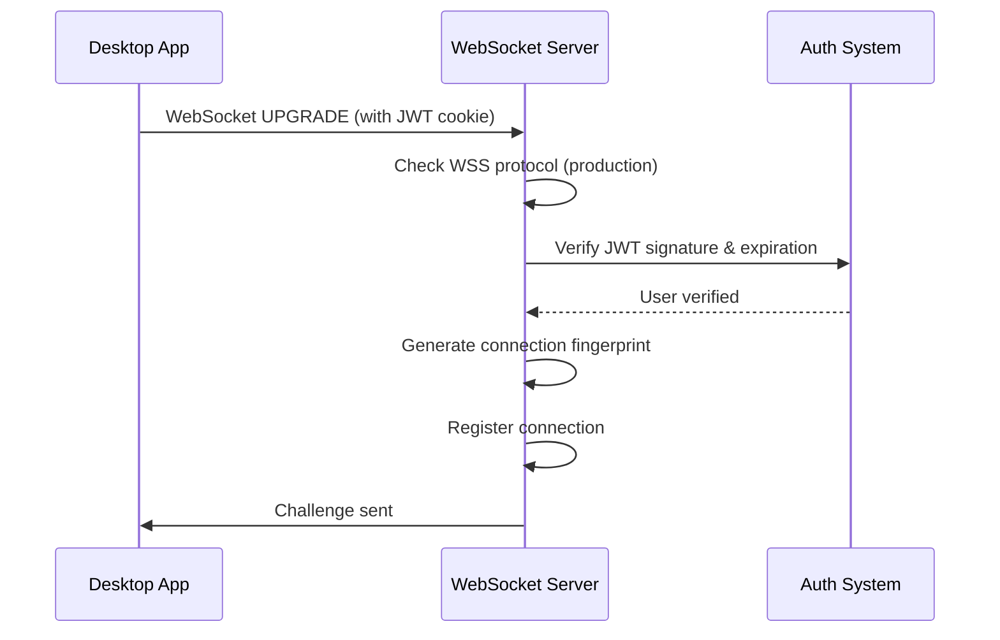
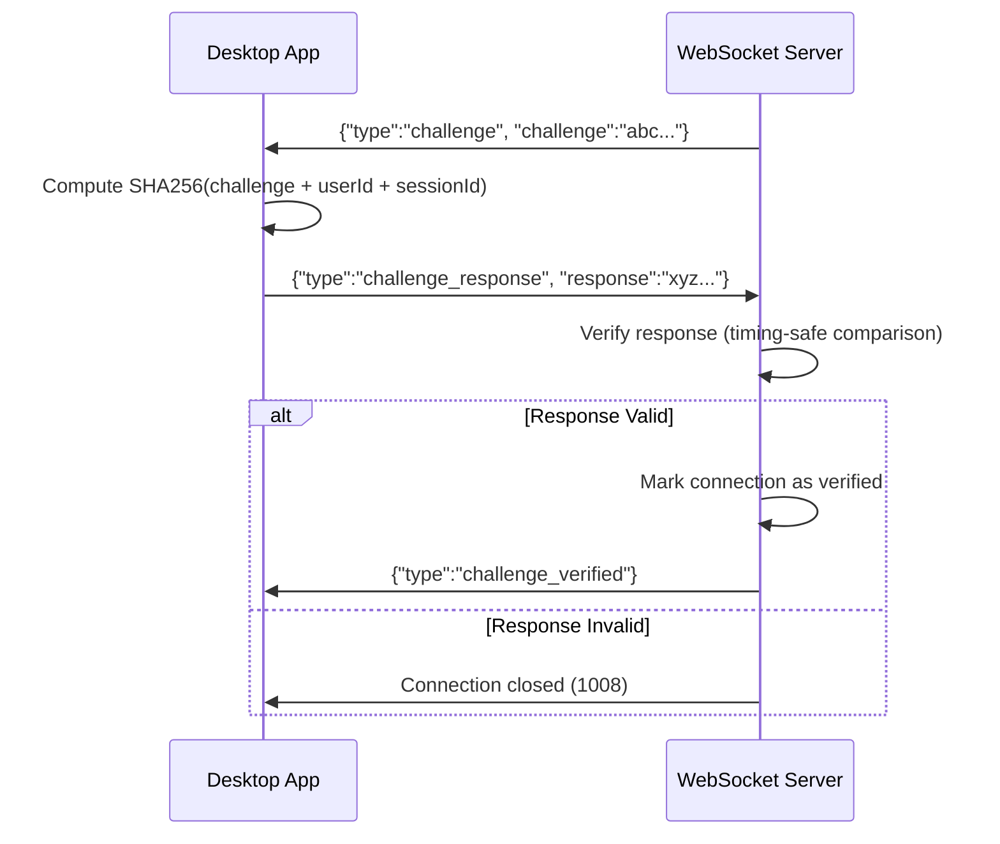
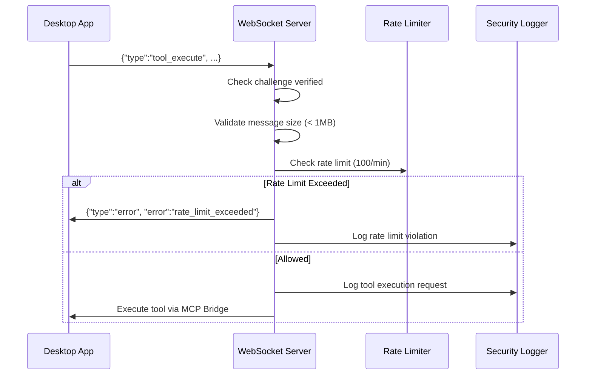

# WebSocket MCP Bridge Security Model

## Overview

The WebSocket MCP Bridge enables PageSpace server to execute MCP (Model Context Protocol) tools locally on the user's desktop via WebSocket connections. This document describes the comprehensive security model implemented to protect against common WebSocket vulnerabilities.

## Security Architecture

### Defense in Depth Strategy

The WebSocket MCP Bridge implements **7 layers of security controls**:

```
┌─────────────────────────────────────────────────────────────────┐
│ Layer 7: Comprehensive Security Logging (Audit Trail)          │
├─────────────────────────────────────────────────────────────────┤
│ Layer 6: Rate Limiting (100 req/min per user)                  │
├─────────────────────────────────────────────────────────────────┤
│ Layer 5: Message Size Validation (1MB max)                     │
├─────────────────────────────────────────────────────────────────┤
│ Layer 4: Challenge-Response Verification                       │
├─────────────────────────────────────────────────────────────────┤
│ Layer 3: Connection Fingerprinting (IP + User-Agent)           │
├─────────────────────────────────────────────────────────────────┤
│ Layer 2: JWT Authentication (httpOnly cookie)                  │
├─────────────────────────────────────────────────────────────────┤
│ Layer 1: Secure Connection (WSS in production)                 │
└─────────────────────────────────────────────────────────────────┘
```

## Connection Flow

### Initial Connection (Layers 1-3)



**Security Checks (Initial Connection):**

1. **Secure Protocol Validation**
   - Production: WSS (secure WebSocket) required
   - Development: WS allowed for local testing
   - Enforcement: Connection closed with code 1008 if non-secure in production

2. **JWT Authentication**
   - Token source: httpOnly, secure cookie (`accessToken`)
   - Validation: Signature, expiration, token version
   - User lookup: Database check for user existence and role
   - Enforcement: Connection closed with code 1008 if invalid

3. **Connection Fingerprinting**
   - Algorithm: `SHA256(IP + User-Agent)`
   - Purpose: Detect session hijacking and device changes
   - Storage: Stored in connection metadata
   - Note: Fingerprint changes don't auto-close connection, but logged for monitoring

### Challenge-Response Flow (Layer 4)



**Security Parameters:**

- **Challenge Size**: 32 bytes (256 bits of entropy)
- **Challenge Expiration**: 30 seconds
- **Max Attempts**: 3 failed attempts before connection closure
- **Algorithm**: `SHA256(challenge + userId + sessionId)`
- **Comparison**: Timing-safe equality check

**Why Challenge-Response?**

Challenge-response provides **post-connection verification** beyond initial JWT authentication:

- **Mitigates Cookie Theft**: Even if JWT cookie is stolen, attacker cannot compute correct response without session ID (which is derived from JWT payload, not cookie value)
- **Prevents Replay Attacks**: Each challenge is unique and time-limited
- **Detects MITM**: Man-in-the-middle cannot forge valid response without access to session ID
- **Defense in Depth**: Additional layer beyond JWT signature verification

### Tool Execution Flow (Layers 5-7)



**Security Checks (Tool Execution):**

1. **Challenge Verification Status**
   - Requirement: Connection MUST have completed challenge-response
   - Enforcement: Reject tool execution if not verified
   - Error: `challenge_required`

2. **Message Size Validation**
   - Max Size: 1MB (1,048,576 bytes)
   - Purpose: Prevent DoS via oversized messages
   - Enforcement: Message rejected, error sent to client

3. **Rate Limiting**
   - Limit: 100 tool execution requests per minute per user
   - Algorithm: Sliding window
   - Block Duration: 15 minutes on violation
   - Enforcement: Request rejected with `Retry-After` header

4. **Security Logging**
   - Events: All tool executions, failures, rate limits
   - Format: Structured JSON for SIEM integration
   - Sensitive Data: Automatically redacted (passwords, tokens, API keys)

## OWASP Top 10 Coverage

### A01 - Broken Access Control

**Controls Implemented:**

- ✅ JWT authentication required for connection
- ✅ Challenge-response prevents unauthorized tool execution
- ✅ Rate limiting prevents abuse (100 req/min)
- ✅ Connection limited to one per user (existing connections closed)
- ✅ Tool execution requires challenge verification

**Attack Scenarios Mitigated:**

- Unauthorized connection attempts → JWT validation fails, connection closed
- Tool execution without verification → Challenge verification required
- Excessive requests → Rate limiting blocks after 100 req/min

### A02 - Cryptographic Failures

**Controls Implemented:**

- ✅ WSS (secure WebSocket) enforced in production
- ✅ JWT signature validation using HS256/RS256
- ✅ Challenge-response uses SHA256 hashing
- ✅ Timing-safe comparison for challenge verification
- ✅ HttpOnly + Secure + SameSite cookies

**Attack Scenarios Mitigated:**

- JWT forgery → Signature verification fails
- Challenge response brute force → Timing-safe comparison prevents timing attacks
- Cookie theft via XSS → HttpOnly flag prevents JavaScript access
- MITM on non-secure connection → WSS enforced in production

### A04 - Insecure Design

**Controls Implemented:**

- ✅ Defense in depth (7 security layers)
- ✅ Challenge-response for post-connection verification
- ✅ Connection fingerprinting for session hijacking detection
- ✅ Rate limiting with progressive blocking
- ✅ Message size validation

**Design Principles Applied:**

- Least privilege: Only verified connections can execute tools
- Fail securely: Invalid messages result in error, not crash
- Defense in depth: Multiple overlapping security controls
- Complete mediation: Every tool request validated

### A07 - Identification and Authentication Failures

**Controls Implemented:**

- ✅ JWT token version validation (invalidates all tokens on password change)
- ✅ Challenge-response prevents session hijacking
- ✅ Max 3 challenge attempts (prevents brute force)
- ✅ 30-second challenge expiration
- ✅ Connection fingerprinting detects device changes

**Attack Scenarios Mitigated:**

- Password change doesn't invalidate WebSocket → Token version mismatch closes connection
- Session hijacking → Fingerprint change logged for monitoring
- Brute force challenge → Max 3 attempts, connection closed

### A09 - Security Logging and Monitoring Failures

**Controls Implemented:**

- ✅ All authentication events logged
- ✅ All tool execution requests logged
- ✅ Rate limit violations logged
- ✅ Challenge verification failures logged
- ✅ Structured logging for SIEM integration
- ✅ Sensitive data automatically redacted

**Logged Security Events:**

| Event | Severity | Details |
|-------|----------|---------|
| `ws_connection_established` | info | userId, IP, fingerprint (partial) |
| `ws_authentication_failed` | warn | IP, reason |
| `ws_challenge_verified` | info | userId |
| `ws_challenge_verification_failed` | warn | userId, reason, attempts |
| `ws_tool_execution_request` | info | userId, serverName, toolName, requestId |
| `ws_tool_execution_result` | info | userId, requestId, success |
| `ws_rate_limit_exceeded` | warn | userId, retryAfter |
| `ws_message_too_large` | warn | userId, size, maxSize |
| `ws_unauthorized_tool_execution_attempt` | warn | userId, toolName |
| `ws_connection_closed` | info | userId, code, reason |
| `ws_error` | error | userId, error message |

## Security Configuration

### Environment Variables

```bash
# Production: Enforce secure connections
NODE_ENV=production

# JWT Secret (for signature verification)
JWT_SECRET=your-secret-key-min-32-chars
```

### Cookie Configuration

The JWT access token is stored in a cookie with these security attributes:

```typescript
{
  httpOnly: true,      // Prevents JavaScript access (XSS mitigation)
  secure: true,        // HTTPS only in production
  sameSite: 'strict',  // CSRF protection
  maxAge: 900000,      // 15 minutes (matches JWT expiration)
  path: '/',
}
```

### Rate Limiting Configuration

```typescript
// Tool execution rate limit
const TOOL_EXECUTION_LIMIT = {
  maxRequests: 100,           // 100 requests
  windowMs: 60000,            // per minute
  blockDurationMs: 900000,    // 15 minutes block on violation
};

// Message size limit
const MAX_MESSAGE_SIZE = 1024 * 1024; // 1MB
```

## Client Implementation Requirements

Desktop clients connecting to the WebSocket MCP Bridge MUST implement:

### 1. Challenge-Response Handler

```typescript
// Client must respond to challenge
ws.on('message', (data) => {
  const message = JSON.parse(data.toString());

  if (message.type === 'challenge') {
    const challenge = message.challenge;

    // Compute response: SHA256(challenge + userId + sessionId)
    const response = computeChallengeResponse(challenge, userId, sessionId);

    // Send response
    ws.send(JSON.stringify({
      type: 'challenge_response',
      response
    }));
  }

  if (message.type === 'challenge_verified') {
    // Connection verified, can now execute tools
  }
});

function computeChallengeResponse(
  challenge: string,
  userId: string,
  sessionId: string
): string {
  return createHash('sha256')
    .update(challenge + userId + sessionId)
    .digest('hex');
}
```

### 2. Error Handling

```typescript
ws.on('message', (data) => {
  const message = JSON.parse(data.toString());

  if (message.type === 'error') {
    switch (message.error) {
      case 'challenge_required':
        // Must complete challenge before tool execution
        console.error('Challenge verification required');
        break;

      case 'rate_limit_exceeded':
        // Wait before retrying
        const retryAfter = message.retryAfter; // seconds
        console.warn(`Rate limited. Retry after ${retryAfter}s`);
        break;

      case 'message_too_large':
        // Reduce message size
        console.error(`Message exceeds ${message.maxSize} bytes`);
        break;
    }
  }
});
```

### 3. Connection Lifecycle

```typescript
ws.on('open', () => {
  // Wait for challenge from server
});

ws.on('close', (code, reason) => {
  switch (code) {
    case 1008: // Policy violation
      // Check reason: 'Unauthorized', 'Challenge verification failed', etc.
      console.error('Connection closed:', reason.toString());
      break;

    case 1000: // Normal closure
      // Reconnect if needed
      break;
  }
});
```

## Security Testing

### Automated Tests

The security test suite covers all OWASP Top 10 controls:

```bash
# Run security tests
npm test -- apps/web/src/app/api/mcp-ws/__tests__/route.security.test.ts
```

Test coverage:

- ✅ A01: Broken Access Control (unauthorized access, rate limiting)
- ✅ A02: Cryptographic Failures (secure connections, JWT validation)
- ✅ A04: Insecure Design (challenge-response, fingerprinting)
- ✅ A07: Authentication Failures (token validation, challenge attempts)
- ✅ A09: Logging Failures (audit trail, sensitive data redaction)

### Manual Security Audit Checklist

- [ ] Verify WSS enforced in production (`isSecureConnection()`)
- [ ] Test JWT validation with expired tokens
- [ ] Test challenge-response with invalid responses
- [ ] Test rate limiting by sending 101 requests in 1 minute
- [ ] Verify fingerprint changes are logged
- [ ] Test message size validation with >1MB payload
- [ ] Verify sensitive data is NOT logged (check console output)
- [ ] Test connection closure on authentication failure
- [ ] Verify existing connections are closed on new connection
- [ ] Test error handling with malformed JSON

## Monitoring and Alerting

### Key Metrics to Monitor

1. **Authentication Failures**
   - Event: `ws_authentication_failed`
   - Alert: >10 failures/minute from same IP
   - Action: Potential brute force attack

2. **Challenge Verification Failures**
   - Event: `ws_challenge_verification_failed`
   - Alert: >5 failures/minute from same user
   - Action: Potential session hijacking attempt

3. **Rate Limit Violations**
   - Event: `ws_rate_limit_exceeded`
   - Alert: Same user repeatedly hitting rate limit
   - Action: Potential abuse or compromised account

4. **Fingerprint Mismatches**
   - Event: `ws_connection_established` with different fingerprint
   - Alert: User connecting from different IP/browser
   - Action: Potential session hijacking (log for investigation)

5. **Message Size Violations**
   - Event: `ws_message_too_large`
   - Alert: >10 oversized messages/minute
   - Action: Potential DoS attack

### SIEM Integration

All security events are logged in structured JSON format for easy SIEM integration:

```json
{
  "timestamp": "2025-10-27T12:34:56.789Z",
  "event": "ws_authentication_failed",
  "ip": "192.168.1.100",
  "severity": "warn",
  "reason": "Invalid or missing JWT"
}
```

Recommended SIEM platforms:

- Splunk: Parse JSON logs, create dashboards for security events
- ELK Stack: Index logs in Elasticsearch, visualize in Kibana
- DataDog: Forward logs via agent, create security monitors
- Sentry: Track authentication failures as errors

## Incident Response

### Suspected Session Hijacking

1. **Detection**: `ws_connection_established` with different fingerprint
2. **Immediate Action**: No automatic action (user may have changed IP/browser)
3. **Investigation**: Review user's recent activity, check for suspicious tool executions
4. **Remediation**: If confirmed, increment user's `tokenVersion` to invalidate all sessions

### Rate Limit Abuse

1. **Detection**: `ws_rate_limit_exceeded` repeatedly for same user
2. **Immediate Action**: User automatically blocked for 15 minutes
3. **Investigation**: Check if legitimate use case or compromised account
4. **Remediation**: If compromised, force password reset, increment `tokenVersion`

### Challenge Verification Failures

1. **Detection**: `ws_challenge_verification_failed` with reason "Too many failed attempts"
2. **Immediate Action**: Connection automatically closed
3. **Investigation**: Check if client implementation issue or attack
4. **Remediation**: If attack, consider IP-based blocking (not implemented by default)

## Security Best Practices

### For Developers

1. **Never Bypass Security Checks**
   - Don't disable challenge-response "for testing"
   - Don't increase rate limits without security review
   - Don't log sensitive data (passwords, full tokens, API keys)

2. **Keep Dependencies Updated**
   - `jose`: JWT library (security-critical)
   - `ws`: WebSocket library
   - `crypto`: Node.js crypto module (built-in)

3. **Test Security Controls**
   - Run security test suite on every PR
   - Add tests for new security features
   - Test error handling paths

4. **Follow Secure Coding Patterns**
   - Use timing-safe comparison for secrets
   - Validate all inputs (message size, format, type)
   - Handle errors gracefully without leaking information

### For Operators

1. **Monitor Security Logs**
   - Set up alerts for authentication failures
   - Review rate limit violations daily
   - Investigate fingerprint mismatches

2. **Rotate Secrets Regularly**
   - JWT secret: Rotate quarterly (requires re-login)
   - Consider key rotation strategy for zero-downtime

3. **Review Security Policies**
   - Rate limits: Adjust based on usage patterns
   - Challenge expiration: Balance security vs. UX
   - Block duration: Consider user impact

4. **Incident Response Plan**
   - Document escalation procedures
   - Define thresholds for automatic blocking
   - Plan for mass token invalidation (tokenVersion++)

## Future Enhancements

### Planned Improvements

1. **IP-Based Rate Limiting**
   - Track failed authentication attempts by IP
   - Implement temporary IP blocking (e.g., 1 hour after 10 failed attempts)
   - Integrate with fail2ban or similar

2. **Geo-Location Anomaly Detection**
   - Track user's typical connection locations
   - Alert on connections from unusual countries
   - Optional: Block connections from high-risk regions

3. **Two-Factor Authentication Integration**
   - Require 2FA verification for WebSocket connections
   - Challenge-response could include TOTP verification
   - Higher security for sensitive operations

4. **Connection Session Management**
   - Admin dashboard to view active WebSocket connections
   - Ability to terminate specific connections
   - Connection history and audit log

5. **Advanced Rate Limiting**
   - Per-tool rate limits (some tools are more expensive)
   - Dynamic rate limiting based on server load
   - Burst allowance for legitimate high-volume use cases

## References

- [OWASP WebSocket Security](https://owasp.org/www-community/vulnerabilities/WebSocket_Security)
- [OWASP Top 10 2021](https://owasp.org/www-project-top-ten/)
- [RFC 6455 - WebSocket Protocol](https://datatracker.ietf.org/doc/html/rfc6455)
- [JWT Best Practices (RFC 8725)](https://datatracker.ietf.org/doc/html/rfc8725)
- [NIST Password Guidelines (SP 800-63B)](https://pages.nist.gov/800-63-3/sp800-63b.html)

---

**Last Updated**: 2025-10-27
**Security Review**: Required quarterly
**Next Review Due**: 2026-01-27
