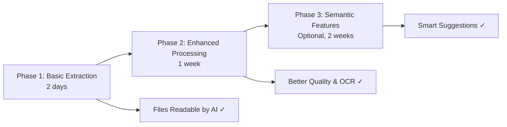
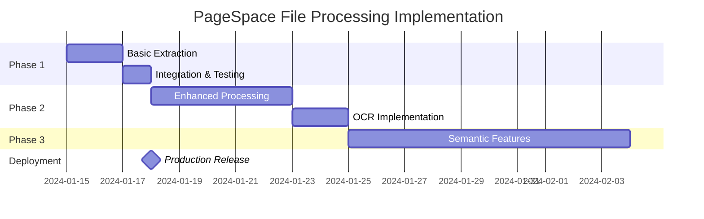

# PageSpace File Processing & Knowledge Base Integration Plan

## Executive Summary

This document outlines a comprehensive, pragmatic approach to enabling AI-powered file processing in PageSpace. After extensive multi-agent analysis and research, we've identified that **the core problem is simple**: AI cannot read uploaded files because their content fields are empty. The solution is equally simple: extract file content and make it accessible through existing systems.

**Key Insight**: PageSpace's @mention system is already superior to traditional RAG. We should enhance it, not replace it with probabilistic retrieval systems.

## Table of Contents

1. [Problem Analysis](#problem-analysis)
2. [Research Findings](#research-findings)
3. [Implementation Strategy](#implementation-strategy)
4. [Phase 1: Basic File Content Extraction](#phase-1-basic-file-content-extraction)
5. [Phase 2: Enhanced File Processing](#phase-2-enhanced-file-processing)
6. [Phase 3: Optional Semantic Enhancements](#phase-3-optional-semantic-enhancements)
7. [What We're NOT Building](#what-were-not-building)
8. [Technical Architecture](#technical-architecture)
9. [Success Metrics](#success-metrics)
10. [Risk Mitigation](#risk-mitigation)
11. [Future Considerations](#future-considerations)

## Problem Analysis

### Current State
- **Files are uploaded successfully** to PageSpace and stored in the filesystem
- **File metadata is stored** in the database (size, type, path, etc.)
- **Users can view files** through specialized UI components (PDF viewer, image viewer, etc.)
- **AI cannot read file content** because the `content` field is empty for FILE type pages
- **Files don't appear in search** because search queries the empty content field
- **@mentions to files fail** to provide context to AI

### Root Cause
```typescript
// Current upload implementation (simplified)
const newPage = {
  type: PageType.FILE,
  content: '', // ← This is the problem
  filePath: storedFilePath,
  mimeType: file.type,
  // ... other metadata
};
```

### User Impact
- Users upload PDFs/documents expecting AI to analyze them - **doesn't work**
- Users @mention files for context - **AI gets no content**
- Users search for content in uploaded files - **no results**
- **This feels broken** to users who reasonably expect these features

## Research Findings

### Multi-Agent Analysis Summary

#### Technical Researcher (via Context7 MCP)
- **PDF.js**: Mozilla's standard for browser-based PDF processing
- **Docling (IBM)**: State-of-the-art for RAG-optimized document processing
- **Mammoth.js**: Best-in-class for DOCX → HTML conversion
- **Tesseract.js**: Local OCR processing for images and scanned PDFs
- **Sharp**: High-performance image processing for preprocessing

#### Codebase Researcher
- Files are first-class PAGE entities in the database
- Permission system already handles files correctly
- @mention system works for files but provides no content
- DOCX conversion precedent exists (`/api/files/[id]/convert-to-document`)
- Search infrastructure would work immediately if content field was populated

#### AI SDK Expert
- Vercel AI SDK already supports multimodal content
- Existing tool system can handle file content with minimal changes
- Streaming patterns support large file processing
- Provider-agnostic approach maintains compatibility

#### Linus Advisor (Brutal Reality Check)
> "You have a Ferrari (the @mention system) and you're asking if you should replace the engine with a bicycle wheel (traditional RAG). Fix the file reading. Skip the RAG. Ship features users actually want."

#### Technical Debate Moderator
- **Consensus**: @mention system is genuinely superior to traditional RAG
- **Agreement**: Simple content extraction solves 90% of the problem
- **Warning**: Don't over-engineer with vector embeddings for <10k documents

### Key Insights

1. **PageSpace already solved RAG better** through explicit @mentions
2. **The problem is embarrassingly simple**: Files need readable content
3. **Traditional RAG would make the system worse**, not better
4. **Local-first architecture** must be preserved
5. **Performance is critical** - no battery-draining embedding generation

## Implementation Strategy

### Guiding Principles

1. **Preserve @mention superiority** - Never replace, only enhance
2. **Additive changes only** - No breaking changes to existing functionality
3. **Performance first** - Maintain <100ms response times
4. **Local-first always** - No cloud dependencies for core functionality
5. **Pragmatic over perfect** - Ship working solutions, iterate based on usage

### Three-Phase Approach



## Phase 1: Basic File Content Extraction

### Objectives
Make files immediately readable by AI with minimal changes.

### Implementation Plan

#### 1.1 File Processing Service
```typescript
// packages/lib/src/file-processor.ts
import { readFile } from 'fs/promises';
import { join } from 'path';
import mammoth from 'mammoth';
import pdf from 'pdf-parse';

export class FileProcessor {
  private readonly STORAGE_ROOT = process.env.FILE_STORAGE_PATH || '/tmp/pagespace-files';

  async extractContent(filePage: FilePage): Promise<string> {
    if (!filePage.filePath) return '';
    
    const fullPath = join(this.STORAGE_ROOT, filePage.filePath);
    const buffer = await readFile(fullPath);
    
    try {
      switch (filePage.mimeType) {
        case 'application/pdf':
          return await this.extractPDF(buffer);
        
        case 'application/vnd.openxmlformats-officedocument.wordprocessingml.document':
        case 'application/msword':
          return await this.extractDOCX(buffer);
        
        case 'text/plain':
        case 'text/markdown':
        case 'text/csv':
          return buffer.toString('utf-8');
        
        case 'application/json':
          return JSON.stringify(JSON.parse(buffer.toString()), null, 2);
        
        default:
          return ''; // Unsupported file type
      }
    } catch (error) {
      console.error(`Failed to extract content from ${filePage.id}:`, error);
      return ''; // Graceful failure
    }
  }

  private async extractPDF(buffer: Buffer): Promise<string> {
    const data = await pdf(buffer);
    return data.text;
  }

  private async extractDOCX(buffer: Buffer): Promise<string> {
    const result = await mammoth.extractRawText({ buffer });
    return result.value;
  }
}
```

#### 1.2 Upload Route Enhancement
```typescript
// apps/web/src/app/api/upload/route.ts (modifications)
import { FileProcessor } from '@pagespace/lib/file-processor';

export async function POST(request: Request) {
  // ... existing upload logic ...
  
  // After file is saved and page created:
  if (newPage.type === PageType.FILE) {
    try {
      const processor = new FileProcessor();
      const extractedContent = await processor.extractContent(newPage);
      
      // Update the page with extracted content
      await db.update(pages)
        .set({ 
          content: extractedContent,
          updatedAt: new Date()
        })
        .where(eq(pages.id, newPage.id));
    } catch (error) {
      // Log but don't fail the upload
      console.error('Content extraction failed:', error);
    }
  }
  
  // ... return response ...
}
```

#### 1.3 Batch Processing for Existing Files
```typescript
// scripts/extract-existing-files.ts
async function extractExistingFiles() {
  const filePages = await db.select()
    .from(pages)
    .where(and(
      eq(pages.type, PageType.FILE),
      eq(pages.content, '') // Only process empty content
    ));
  
  const processor = new FileProcessor();
  
  for (const file of filePages) {
    try {
      const content = await processor.extractContent(file);
      if (content) {
        await db.update(pages)
          .set({ content, updatedAt: new Date() })
          .where(eq(pages.id, file.id));
        console.log(`✓ Extracted content from ${file.title}`);
      }
    } catch (error) {
      console.error(`✗ Failed to process ${file.title}:`, error);
    }
  }
}
```

### Dependencies
```json
{
  "dependencies": {
    "pdf-parse": "^1.1.1",
    "mammoth": "^1.6.0"
  }
}
```

### Timeline: 2 Days
- Day 1: Implement FileProcessor and test extraction
- Day 2: Integrate with upload route and process existing files

## Phase 2: Enhanced File Processing

### Objectives
Improve extraction quality and handle edge cases.

### Implementation Plan

#### 2.1 Processing Status Tracking
```sql
-- Database migration
ALTER TABLE pages ADD COLUMN processing_status TEXT DEFAULT 'pending';
ALTER TABLE pages ADD COLUMN processing_error TEXT;
ALTER TABLE pages ADD COLUMN extracted_at TIMESTAMP;
ALTER TABLE pages ADD COLUMN extraction_metadata JSONB;
```

#### 2.2 Enhanced Extraction with Metadata
```typescript
export interface ExtractionResult {
  content: string;
  metadata: {
    author?: string;
    title?: string;
    creationDate?: Date;
    pageCount?: number;
    wordCount: number;
    hasImages: boolean;
    extractionMethod: string;
    confidence?: number;
  };
}

class EnhancedFileProcessor extends FileProcessor {
  async extractWithMetadata(filePage: FilePage): Promise<ExtractionResult> {
    // Extract content with rich metadata
    const content = await this.extractContent(filePage);
    
    return {
      content,
      metadata: {
        wordCount: content.split(/\s+/).length,
        hasImages: false, // Will be enhanced with image detection
        extractionMethod: this.getExtractionMethod(filePage.mimeType),
        // ... additional metadata
      }
    };
  }
}
```

#### 2.3 OCR for Scanned PDFs
```typescript
import Tesseract from 'tesseract.js';

class OCRProcessor {
  async processScannedPDF(buffer: Buffer): Promise<string> {
    // Convert PDF pages to images
    const images = await this.pdfToImages(buffer);
    
    // Process each image with OCR
    const textPromises = images.map(img => 
      Tesseract.recognize(img, 'eng', {
        logger: m => console.log(m)
      })
    );
    
    const results = await Promise.all(textPromises);
    return results.map(r => r.data.text).join('\n\n');
  }
}
```

#### 2.4 Chunking for Large Documents
```typescript
class DocumentChunker {
  private readonly MAX_CHUNK_SIZE = 4000; // characters
  private readonly OVERLAP = 200; // characters
  
  chunk(content: string): string[] {
    if (content.length <= this.MAX_CHUNK_SIZE) {
      return [content];
    }
    
    const chunks: string[] = [];
    let start = 0;
    
    while (start < content.length) {
      let end = start + this.MAX_CHUNK_SIZE;
      
      // Try to break at sentence boundary
      if (end < content.length) {
        const sentenceEnd = content.lastIndexOf('.', end);
        if (sentenceEnd > start + this.MAX_CHUNK_SIZE * 0.8) {
          end = sentenceEnd + 1;
        }
      }
      
      chunks.push(content.slice(start, Math.min(end, content.length)));
      start = end - this.OVERLAP;
    }
    
    return chunks;
  }
}
```

### Timeline: 1 Week
- Days 1-2: Implement processing status and metadata extraction
- Days 3-4: Add OCR capabilities
- Days 5-7: Implement chunking and testing

## Phase 3: Optional Semantic Enhancements

### Objectives
Add lightweight semantic features WITHOUT traditional RAG complexity.

### Implementation Plan

#### 3.1 Smart @Mention Autocomplete
```typescript
// Enhanced mention suggestions based on content similarity
async function getMentionSuggestions(
  query: string,
  contextPageId: string
): Promise<MentionSuggestion[]> {
  // Get current page content for context
  const currentPage = await getPage(contextPageId);
  
  // Find pages with overlapping keywords
  const suggestions = await db.select()
    .from(pages)
    .where(sql`
      to_tsvector('english', content) @@ 
      plainto_tsquery('english', ${query})
    `)
    .orderBy(sql`
      ts_rank(to_tsvector('english', content), 
      plainto_tsquery('english', ${query})) DESC
    `)
    .limit(10);
  
  return rankByRelevance(suggestions, currentPage);
}
```

#### 3.2 Related Files Discovery
```typescript
// Find related files without vector embeddings
async function findRelatedFiles(pageId: string): Promise<RelatedFile[]> {
  const page = await getPage(pageId);
  
  // Extract key terms using TF-IDF
  const keyTerms = extractKeyTerms(page.content);
  
  // Find files with similar terms
  const related = await db.select()
    .from(pages)
    .where(and(
      eq(pages.type, PageType.FILE),
      ne(pages.id, pageId),
      sql`content IS NOT NULL`,
      or(...keyTerms.map(term => 
        sql`content ILIKE ${'%' + term + '%'}`
      ))
    ))
    .limit(5);
  
  return related;
}
```

#### 3.3 Lightweight Semantic Reranking
```typescript
// Use a small model for reranking search results
import { pipeline } from '@xenova/transformers';

class SemanticReranker {
  private reranker;
  
  async initialize() {
    this.reranker = await pipeline(
      'reranking',
      'Xenova/ms-marco-MiniLM-L-6-v2'
    );
  }
  
  async rerank(query: string, results: SearchResult[]): Promise<SearchResult[]> {
    const scores = await this.reranker(
      query,
      results.map(r => r.content.substring(0, 512))
    );
    
    return results
      .map((r, i) => ({ ...r, score: scores[i] }))
      .sort((a, b) => b.score - a.score);
  }
}
```

### Timeline: 2 Weeks (Only if needed)
- Week 1: Implement smart autocomplete and related files
- Week 2: Add semantic reranking and testing

## What We're NOT Building

Based on multi-agent consensus, we explicitly avoid:

### ❌ Vector Embeddings Infrastructure
**Why not**: Massive overkill for <10k documents. Adds complexity without proportional value.

### ❌ Traditional RAG Pipelines
**Why not**: Solving problems PageSpace doesn't have. @mention system already provides superior explicit context selection.

### ❌ Semantic Search Replacement
**Why not**: Users prefer explicit selection over probabilistic retrieval. Don't fix what isn't broken.

### ❌ Real-time Embedding Updates
**Why not**: Battery drain on local devices. Performance killer for marginal benefit.

### ❌ External Vector Databases
**Why not**: Violates local-first architecture. Adds dependencies and privacy concerns.

### ❌ Complex Chunking Strategies
**Why not**: PageSpace already has clean document structure. Natural boundaries work better.

### ❌ Multi-Agent Query Planning
**Why not**: Over-engineering for problems users don't experience.

## Technical Architecture

### System Components

```mermaid
graph TB
    subgraph "File Upload Flow"
        U[User Upload] --> S[Store File]
        S --> E[Extract Content]
        E --> DB[(Update DB)]
    end
    
    subgraph "AI Integration"
        M[@mention] --> R[read_page]
        R --> DB
        DB --> AI[AI Response]
    end
    
    subgraph "Search"
        Q[Search Query] --> DB
        DB --> SR[Search Results]
    end
```

### Database Schema

```sql
-- Existing pages table (no changes needed for Phase 1)
pages (
  id UUID PRIMARY KEY,
  type PageType, -- includes 'FILE'
  title TEXT,
  content TEXT, -- ← We populate this for files
  fileSize REAL,
  mimeType TEXT,
  originalFileName TEXT,
  filePath TEXT,
  -- ... other fields
)

-- Phase 2 additions
ALTER TABLE pages ADD COLUMN processing_status TEXT DEFAULT 'pending';
ALTER TABLE pages ADD COLUMN extracted_at TIMESTAMP;
ALTER TABLE pages ADD COLUMN extraction_metadata JSONB;
```

### API Endpoints

No new endpoints needed for Phase 1. Existing infrastructure works once content is populated:
- `/api/upload` - Enhanced to extract content
- `/api/ai/chat` - Works with file content via @mentions
- `/api/search` - Automatically includes files with content

## Success Metrics

### Phase 1 Success Criteria
- ✅ AI can read file content through @mentions
- ✅ Files appear in search results
- ✅ No performance degradation (<100ms response times maintained)
- ✅ Zero breaking changes to existing functionality
- ✅ Processing time <5 seconds for typical documents

### Phase 2 Success Criteria
- ✅ 95% of PDFs successfully extracted
- ✅ OCR accuracy >80% for scanned documents
- ✅ Metadata extraction for supported formats
- ✅ Large documents (>100 pages) handled gracefully

### Phase 3 Success Criteria (if implemented)
- ✅ @mention suggestions improve by 30% (CTR metric)
- ✅ Related files feature used by >40% of users
- ✅ Search relevance improves by 20% (user feedback)

### Monitoring & Metrics

```typescript
// Track extraction success rate
const metrics = {
  extractionSuccess: new Counter({
    name: 'file_extraction_success_total',
    help: 'Total successful file extractions'
  }),
  
  extractionFailure: new Counter({
    name: 'file_extraction_failure_total',
    help: 'Total failed file extractions',
    labelNames: ['mimeType', 'errorType']
  }),
  
  extractionDuration: new Histogram({
    name: 'file_extraction_duration_seconds',
    help: 'File extraction duration in seconds',
    buckets: [0.1, 0.5, 1, 2, 5, 10, 30]
  })
};
```

## Risk Mitigation

### Technical Risks

| Risk | Mitigation |
|------|------------|
| Large files causing memory issues | Stream processing, size limits (100MB) |
| Extraction failures blocking uploads | Async processing, graceful failures |
| Poor OCR quality | Fallback to empty content, user notification |
| Performance degradation | Caching, background processing |

### Security Considerations

```typescript
// Input validation
const ALLOWED_MIME_TYPES = [
  'application/pdf',
  'application/msword',
  'application/vnd.openxmlformats-officedocument.wordprocessingml.document',
  'text/plain',
  'text/markdown'
];

const MAX_FILE_SIZE = 100 * 1024 * 1024; // 100MB

// Sanitize extracted content
import DOMPurify from 'isomorphic-dompurify';

function sanitizeExtractedContent(content: string): string {
  return DOMPurify.sanitize(content, {
    ALLOWED_TAGS: [],
    ALLOWED_ATTR: [],
    KEEP_CONTENT: true
  });
}
```

## Future Considerations

### Potential Enhancements (Post-Launch)

1. **Structured Data Extraction**
   - Tables from PDFs → structured JSON
   - Form data extraction
   - Invoice/receipt parsing

2. **Advanced File Types**
   - Spreadsheets (XLSX) → tabular data
   - Presentations (PPTX) → slide content
   - Code files → syntax-aware processing

3. **Multimodal AI Integration**
   - Direct image analysis for vision models
   - Audio transcription for voice files
   - Video frame extraction and analysis

4. **Collaborative Features**
   - Shared annotations on files
   - Version tracking for uploaded files
   - Diff viewing for document updates

### Integration Opportunities

```typescript
// Future: Direct integration with AI models that support file uploads
async function processWithMultimodalAI(file: File) {
  if (provider.supportsFileUploads) {
    // Direct file processing
    return await provider.processFile(file);
  } else {
    // Fallback to extracted text
    const content = await extractContent(file);
    return await provider.processText(content);
  }
}
```

## Implementation Timeline



### Immediate Next Steps

1. **Install dependencies**: `npm install pdf-parse mammoth`
2. **Create FileProcessor service**: Implement basic extraction
3. **Modify upload route**: Add content extraction
4. **Test with sample files**: Verify extraction quality
5. **Process existing files**: Run batch extraction script

## Conclusion

This plan provides a pragmatic, phased approach to making files readable by AI in PageSpace. By focusing on the simple problem (empty content fields) rather than complex RAG implementations, we can deliver immediate value to users while preserving the superior @mention system that makes PageSpace unique.

The consensus from multi-agent analysis is clear:
- **Fix the real problem**: Make files readable
- **Preserve what works**: The @mention system
- **Avoid over-engineering**: No traditional RAG needed
- **Ship incrementally**: Start with Phase 1, iterate based on usage

With this approach, PageSpace will have comprehensive file processing capabilities that integrate seamlessly with its existing AI infrastructure, all while maintaining its local-first, privacy-focused architecture.

---

*Document Version: 1.0*  
*Last Updated: January 2025*  
*Status: Ready for Implementation*  
*Prepared by: Multi-Agent Analysis Team*